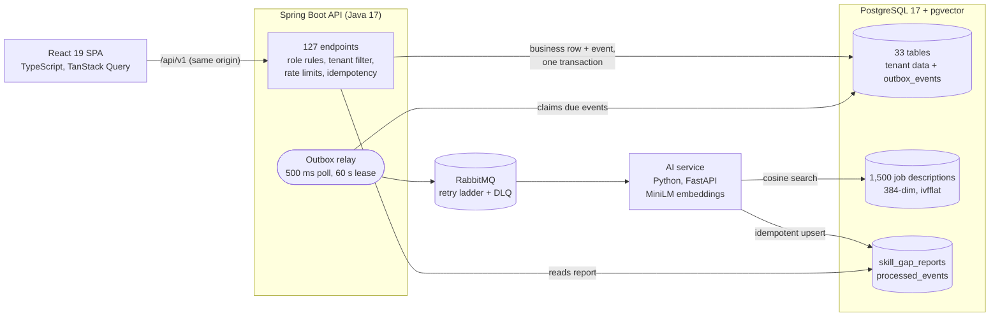
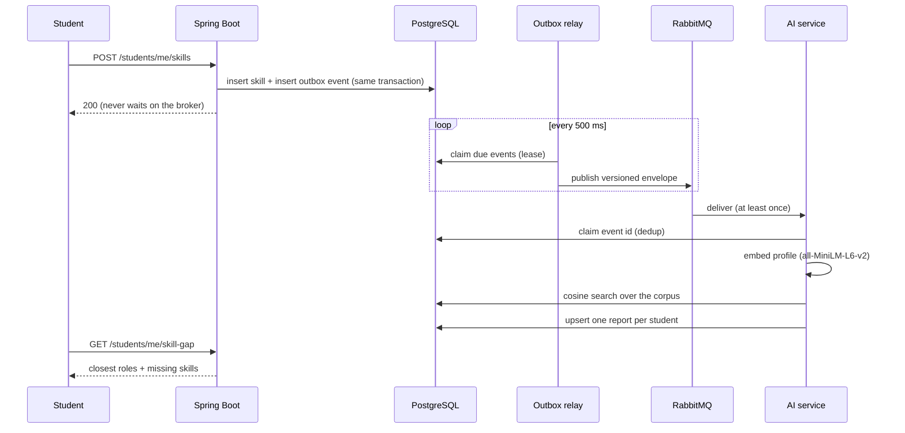

# SkillBridge

**A multi-tenant training platform for college placement cells, with an
event-driven AI engine that measures every student's skills against 1,500 real
industry job descriptions.**

Colleges run training batches, a three-level syllabus, per-topic grading,
enrollment requests and trainer feedback in one place, each college fully
isolated from the others. When a student's skills change, an asynchronous
pipeline embeds their profile, runs a vector search over a pgvector corpus of
job postings, and stores a skill-gap report: the roles they are closest to, and
the skills those roles ask for that they don't have yet.

I built it end to end: the domain model, the API, security, messaging, the AI
service, the React frontend, the CI pipeline and the deployment tooling.


---

## By the numbers

Every figure below is reproducible from this repository. The command or file
that produces it is in the right-hand column.

| | | Source |
|---|---|---|
| **127** | REST endpoints, each with an explicit role rule that a test checks against a checked-in table | `EndpointRolesTest`, `endpoint-roles.txt` |
| **522** | backend tests: 276 unit + 246 integration against real PostgreSQL and RabbitMQ, **0 skipped** | `./mvnw verify` |
| **90%** | mutation score on domain logic (35 of 39 mutants killed; the build fails below 89%) | PIT |
| **70.4% / 56.7%** | backend line / branch coverage, both test tiers merged | JaCoCo |
| **293** | further tests: 122 in the AI service (unit, database, real broker) and 171 in the frontend | `unittest`, Vitest |
| **13** | architecture rules that fail the build (transactions, pagination, caching, messaging, entities, errors, roles, test tiering) | `src/test/.../architecture/` |
| **10** | CI jobs, from API-drift detection to promtool-tested alert rules | `.github/workflows/ci.yml` |
| **1,500 × 384** | job descriptions × embedding dimensions (all-MiniLM-L6-v2), searched by cosine distance in pgvector | `industry_job_descriptions` |
| **33 / 10** | tables / versioned Flyway migrations | `db/migration/V1…V10` |
| **19 → 5** | SQL statements for the admin students page, after removing an N+1 and an eager-fetch fan-out | commit `2efa424` |
| **5.00 → 2.00** | connection checkouts per request, after making service reads transactional | commit `2e0111d` |
| **20** | redundant indexes found and dropped from the inherited schema | commit `96050a3` |
| **0 → 5** | matched jobs per student after switching the vector search from L2 to cosine distance | commit `4b53f5c`, `JobSearchFunctionTest` |

---

## Architecture



### How a skill change becomes a report



A student's save never depends on the broker or the model being up. A broker
outage delays events; it cannot lose them. That is tested by stopping a real
RabbitMQ mid-stream and checking that every event arrives once it is back.

---

## Highlights

**Transactional outbox, not dual writes.** The business row and its event
commit in one transaction. A relay publishes afterwards and claims its work
with a lease, so a second backend instance would not double-publish.
`OutboxWriter` is `@Transactional(propagation = MANDATORY)`: called outside a
transaction, it fails loudly instead of committing an event for a change that
rolled back. This replaced an after-commit publisher that silently lost events
whenever the broker was down.

**An at-least-once consumer that processes each event once.** The AI service
claims each event id in `processed_events` before acting. It retries on a
5 s → 30 s → 5 min ladder of TTL delay queues, dead-letters what still fails
with the error recorded, and drains cleanly on `SIGTERM`. All of this is tested
against a real broker, including an outage mid-stream and a shutdown with a
delivery in flight.

**Versioned event contracts, enforced from both languages.** JSON Schemas live
in `contracts/`. `AiEventContractTest` (Java) and `test_ai_event_contract.py`
(Python) both validate against them, so neither side can change the wire
format alone. The version travels in the message body, because a dead-lettered
and replayed message keeps its body and loses its headers.

**Tenant isolation with two independent layers, and a test built to defeat
them.** Tenant-scoped queries carry an explicit college predicate, and a
Hibernate filter is enabled per request inside the transaction as a second
layer: removing either one alone did not open a cross-tenant read.
`CrossTenantAccessTest` walks the route table and replays every by-id and write
endpoint with another college's ids. Any answer but `404` fails the build: a
`403` would confirm the row exists.

**Vector search in the database it describes.** 1,500 × 384 vectors is about
2 MB, so pgvector next to the data beats a separate vector store and its
consistency problem. The search ranks by cosine distance (`<=>`) on an ivfflat
index. A test runs `EXPLAIN` with sequential scans disabled to prove the index
is used.

**Session security that assumes the token will leak.** The 15-minute access
token lives in memory only, never in `localStorage`. The refresh token is an
HttpOnly `SameSite=Lax` cookie with a 14-day life, rotated atomically on every
use and grouped into families with reuse detection: presenting a spent token
revokes the whole family. Deactivating a user or changing a password takes
effect immediately. Login failures are uniform, and login is limited to 5
attempts a minute and 20 an hour (Bucket4j, one of five rate-limit tiers).

**Architecture rules that fail the build.** ArchUnit and custom rule tests pin
the design, not just the behaviour:
- a named role annotation on every endpoint, checked against a checked-in table;
- no database connection held across a network call;
- transactional reads;
- paginated collections;
- one error model;
- no Lombok `@Data` on entities;
- secrets never logged;
- messaging only through the outbox.

`SuiteTieringTest` fails the build if a test ever starts skipping itself. It
exists because CI once reported success while 64 of 169 tests were silently
skipped.

**Idempotent writes where retries hurt.** Creating a company, creating a batch
and adding a student project take an `Idempotency-Key` header; none of those
tables has a natural unique constraint to catch a double submit. A retry gets
the stored response back (`Idempotent-Replay: true`), and the same key with a
different body gets `422` rather than a silent second record. Replaying a dead
letter is idempotent by construction: the row is locked and must still be
pending.

**A CSV import that tells you what went wrong.** The bulk import checks the
whole file up front (at most 1 MB and 2,000 rows), then commits each row in its
own transaction, so one bad row never rolls back the good ones. It reports
errors row by row, and recognises a re-uploaded file by its SHA-256. Each
imported account gets an invitation email, sent only after its row has
committed.

**A pipeline that tells the truth.** Ten CI jobs:
- API drift between frontend calls and backend routes;
- a fast unit tier;
- an integration tier on Testcontainers;
- PIT mutation testing;
- the AI contract, store and real-broker suites;
- Prometheus alert rules checked with `promtool`;
- the frontend build, tests and zero-warning lint;
- the container images.

The frontend has its own build-failing rules: every colour pair meets WCAG AA
in both themes, no link points at a missing route, the API base URL stays
relative, and every number on the landing page is checked against the real
configuration.

---

## Tech stack, and why

| Layer | Choice | Why |
|---|---|---|
| API | **Java 17, Spring Boot 3.5**, Spring Security, JPA/Hibernate | Mature transaction and security model; Hibernate filters give tenant scoping a second layer |
| Schema | **Flyway** | Versioned, reviewable migrations; the test database is built from the same files |
| Database | **PostgreSQL 17 + pgvector + pg_trgm** | One store for relational data, embeddings and fuzzy search: no second system to keep consistent |
| Messaging | **RabbitMQ** + transactional outbox | Decouples the save from the analysis; durable queues, delay queues and a dead-letter exchange |
| AI service | **Python 3.12, FastAPI**, sentence-transformers (`all-MiniLM-L6-v2`) | The ML ecosystem lives in Python; a small, fast embedding model that runs on a CPU |
| Frontend | **React 19, TypeScript, Vite**, TanStack Query, React Hook Form + Zod, Tailwind | Typed end to end; server state cached and invalidated rather than hand-managed |
| Auth | JWT (JJWT), rotating refresh-token cookies, Bucket4j | Short-lived bearer tokens, revocable sessions, per-tier rate limits |
| Caching | Caffeine | In-process: one JVM, so a distributed cache would buy coordination nothing needs |
| Observability | Micrometer + Prometheus, structured logs with correlation ids | 8 alert rules for the messaging path, versioned and tested with `promtool` |
| Testing | JUnit 5, Testcontainers, ArchUnit, PIT, JaCoCo, Vitest, MSW | Real PostgreSQL and RabbitMQ in tests; mutation testing where coverage would flatter |
| Delivery | GitHub Actions → GHCR, Docker Compose, Caddy | Images built and smoke-tested once in CI; hosts only pull |

---

## Deployment design

The repository contains a complete, tested deployment design in `deploy/`:
- the SPA on **Vercel**;
- the API, AI service, RabbitMQ and **Caddy** under Docker Compose on one
  small **EC2** host;
- the database on **Supabase**.

CI already builds, smoke-tests and publishes both images to GHCR
(`:main` and an immutable `:sha-<commit>`).

The decision that carries the design: Vercel **rewrites `/api/*` to the API
host** instead of the browser calling it. The refresh token is a
`SameSite=Lax` cookie, and a cross-site call would not send it, ending every
session at the first access-token expiry. Proxied, every request is same-site
and CORS disappears. Locally, Vite's dev proxy does the same job, so
development and production have the same shape.

The scripts and templates are tested against stubs and throwaway containers:
- the Vercel rewrite order;
- the CloudFormation cost guardrails, including a budget that ignores credits
  so it actually alerts;
- the instance control script;
- a database helper that is proven to keep passwords out of `ps`.

They have not been applied to a cloud account. Details:
[docs/DEPLOYMENT.md](docs/DEPLOYMENT.md) and
[skillbridge-frontend/VERCEL.md](skillbridge-frontend/VERCEL.md).

---

## Engineering notes

| Topic | Document |
|---|---|
| Security model, each layer with the test that holds it | [docs/SECURITY.md](docs/SECURITY.md) |
| Test tiers, and why a test that has never failed proves nothing | [docs/TESTING_STRATEGY.md](docs/TESTING_STRATEGY.md) |
| Event envelope, versioning and compatibility | [docs/EVENT_SCHEMA.md](docs/EVENT_SCHEMA.md) |
| Dead-letter handling and replay | [docs/RUNBOOK_DLQ.md](docs/RUNBOOK_DLQ.md) |
| Connection pool sizing against a pooler's real ceiling | [docs/CONNECTION_POOL.md](docs/CONNECTION_POOL.md) |
| Indexes, and the queries they serve | [docs/INDEX_STRATEGY.md](docs/INDEX_STRATEGY.md) |
| What is cached, and why so little | [docs/CACHING_STRATEGY.md](docs/CACHING_STRATEGY.md) |
| Timeouts, retries and backoff | [docs/TIMEOUTS.md](docs/TIMEOUTS.md) |
| Performance budget | [docs/PERFORMANCE_BUDGET.md](docs/PERFORMANCE_BUDGET.md) |
| API versioning | [docs/API_VERSIONING.md](docs/API_VERSIONING.md) |
| Logging | [docs/LOGGING.md](docs/LOGGING.md) |
| Deployment design | [docs/DEPLOYMENT.md](docs/DEPLOYMENT.md) |

---

## Running it locally

Requires Docker, JDK 17+, Node 20.19+ (Vite 7) and Python 3.12.

```bash
cp .env.example .env          # set SKILLBRIDGE_DB_PASSWORD and the AI service's AMQP_URL / AI_DATABASE_URL
docker compose up -d          # PostgreSQL + pgvector :5433, RabbitMQ :5672 (UI :15672), Mailpit :8026
```

```bash
cd skillbridge-backend
cp src/main/resources/application-local.yaml.example src/main/resources/application-local.yaml
./mvnw spring-boot:run        # :8080; Flyway builds the schema on first start
```

```bash
cd skillbridge-ai-service
python3 -m venv venv && source venv/bin/activate && pip install -r requirements.txt
python -m uvicorn main:app --port 8000
```

```bash
cd skillbridge-frontend
npm install && npm run dev    # :5173; Vite proxies /api to :8080
```

The job-description corpus is data, not schema: the migrations create the
table, and the 1,500 embedded rows are loaded from a database dump that is not
published. Without it, the whole pipeline still runs; it just finds no jobs to
match. Every email the application sends is caught by Mailpit at
http://localhost:8026.

## Tests

```bash
cd skillbridge-backend && ./mvnw test      # fast tier: 276 tests
cd skillbridge-backend && ./mvnw verify    # + integration tier on Testcontainers (246) and the coverage gate
cd skillbridge-backend && ./mvnw test-compile org.pitest:pitest-maven:mutationCoverage   # mutation testing
cd skillbridge-ai-service && python -m unittest discover -s tests -t .
cd skillbridge-frontend && npm test && npm run lint
./scripts/check-api-drift.sh               # frontend calls vs backend routes
```

---

## Repository layout

```
skillbridge-backend/      Spring Boot API: auth, colleges, batches, syllabus, progress,
                          enrollment, feedback, companies, bulk import, skill gap
skillbridge-ai-service/   FastAPI + resilient AMQP consumer: embed, search, report
skillbridge-frontend/     React SPA, one dashboard per role
skillbridge-etl-pipeline/ One-time ingestion that embedded the job corpus
contracts/                JSON Schemas for events and reports, shared by Java and Python
deploy/                   Deployment design: Compose, Caddy, systemd, CloudFormation, and their tests
ops/prometheus/           Alert rules and their promtool tests
scripts/                  API drift check, database tooling
docs/                     Engineering notes
```

---

## What I would build next

- **Tune the vector index for recall, and test it.** The index uses pgvector's
  default of one probe across 100 lists. Measured against an exact search,
  that returns 20% of the true top-5 jobs for a student profile. At 10 probes it
  returns 95%. At 1,500 rows an exact scan takes about 5 ms, so the fix is
  one setting or no index at all. The guardrail is a test that compares index
  results with exact results and fails below a recall threshold.
- **Reasoning over the gap, not just retrieval.** The retrieval is real: a
  real embedding model over a real corpus with a real index. The gap itself is
  skill extraction and set difference. An LLM step that explains *why* a role
  fits, cached per report, is the natural next layer.
- **Screens for the APIs that have none yet:** editing skills, the audit log
  and the dead-letter queue are complete, tested endpoints with no UI.
- **A one-time set-password link** in the invitation email, in place of the
  temporary password it carries today.
- **Row-level security as a second, database-level gate.** Today one
  application writes tenant data, and isolation is enforced and tested there;
  [docs/SECURITY.md](docs/SECURITY.md) records the trade-off.
- **Java 21**, for virtual threads in the outbox relay and the mail sender.
