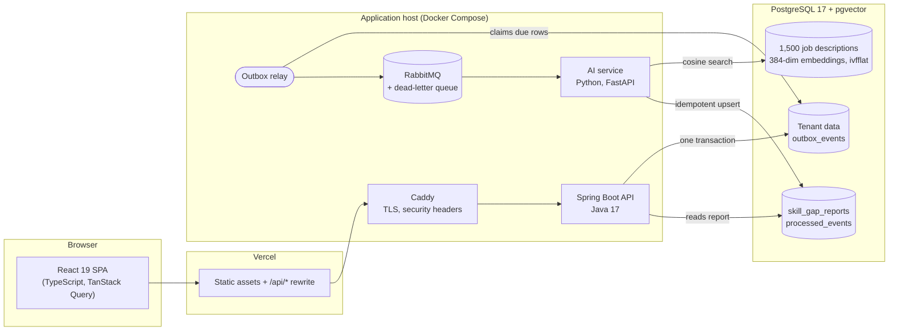
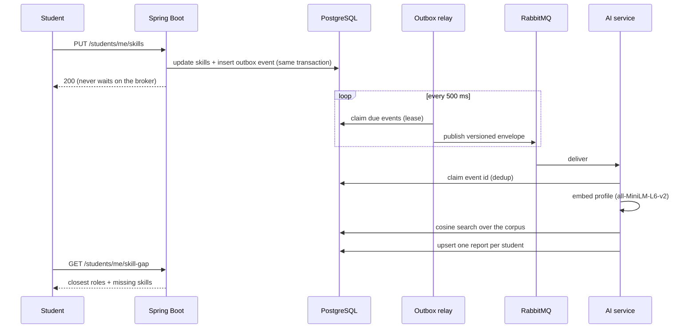

# SkillBridge

**A multi-tenant training and placement platform for colleges, with an
event-driven AI engine that measures every student's skills against 1,500 real
industry job descriptions.**

Colleges run training batches, syllabus progress, trainer feedback and
placements in one place. When a student's skills change, an asynchronous
pipeline embeds their profile, searches a pgvector corpus of job postings, and
stores a skill-gap report: the roles they are closest to, and the skills worth
learning next.

I built it end to end: domain model, API, security, messaging, the AI service,
the React frontend, the CI pipeline and the deployment.


---

## Architecture



### How a skill change becomes a report



A student's save never depends on the broker or the model being up. A broker
outage delays events; it cannot lose them.

---

## Highlights

**Transactional outbox, not dual writes.** The business row and its event
commit in one transaction; a relay publishes afterwards with a lease, so a
second backend instance would not double-publish. `OutboxWriter` is
`@Transactional(propagation = MANDATORY)`: called outside a transaction it
fails loudly instead of committing an event for a change that rolled back.

**An at-least-once consumer that behaves exactly once.** The AI service claims
each event id in `processed_events` before acting, retries on a 5 s → 30 s →
5 min ladder of TTL delay queues, dead-letters what still fails with the
error recorded, and drains cleanly on `SIGTERM`. Tested against a real
broker, including an outage mid-stream.

**Versioned event contracts, enforced from both languages.** JSON Schemas
live in `contracts/`; `AiEventContractTest` (Java) and
`test_ai_event_contract.py` (Python) both validate against them, so neither
side can change the wire format alone. The version is in the message body,
because a dead-lettered and replayed message keeps its body and loses its
headers.

**Tenant isolation with two independent layers, and a test built to defeat
them.** Explicit college predicates plus a Hibernate filter enabled per
request inside the transaction. `CrossTenantAccessTest` walks the route table
and replays every by-id and write endpoint with another college's ids; any
answer but `404` fails the build (a `403` would confirm the row exists).

**Vector search in the database it describes.** 1,500 × 384 vectors is about
2 MB, so pgvector next to the data beats a separate vector store and its
consistency problem. Cosine ranking (`<=>`) on an ivfflat index, and a test that
runs `EXPLAIN` with sequential scans disabled to prove the index is used.

**Session security that assumes the token will leak.** The 15-minute access
token lives in memory only. The refresh token is an HttpOnly, `SameSite=Lax`
cookie, rotated atomically on every use, grouped into families with reuse
detection: presenting a spent token revokes the whole family. A password
change revokes every session. Login failures are uniform, and login is limited
to 5 a minute and 20 an hour per client (Bucket4j).

**Architecture rules that fail the build.** ArchUnit and custom tests pin the
design, not just the behaviour: role annotations on every endpoint (with an
endpoint-to-roles table under test), no connection held across remote calls,
transactional reads, paginated collections, one error model, no Lombok
`@Data` on entities, secrets never logged, and messaging only through the
outbox.

**Idempotent writes where retries hurt.** Creating a student, a company or a
batch, and replaying a dead letter, take an `Idempotency-Key`: a retry gets
the stored response back (`Idempotent-Replay: true`), and the same key with a
different body gets `422` rather than a silent second record. The CSV bulk
import streams the file, commits each row in its own transaction, reports
row-level errors, and recognises a re-uploaded file by its SHA-256.

**A pipeline that tells the truth.** Ten CI jobs: API drift between frontend
calls and backend routes, a fast unit tier, an integration tier on
Testcontainers, PIT mutation testing on domain logic, the AI contract, store
and real-broker suites, Prometheus alert rules checked with `promtool`, the
frontend build, tests and lint, and the deployment images. `SuiteTieringTest`
fails the build if a test ever starts skipping itself.

---

## Tech stack, and why

| Layer | Choice | Why |
|---|---|---|
| API | **Java 17, Spring Boot 3.5**, Spring Security, JPA/Hibernate | Mature transaction and security model; Hibernate filters give tenant scoping a second layer |
| Schema | **Flyway** | Versioned, reviewable migrations; the test database is built from the same files |
| Database | **PostgreSQL 17 + pgvector** | One store for relational data and embeddings: no second system to keep consistent |
| Messaging | **RabbitMQ** + transactional outbox | Decouples the save from the analysis; durable queues and a dead-letter exchange |
| AI service | **Python, FastAPI**, sentence-transformers (`all-MiniLM-L6-v2`), LangChain | The ML ecosystem lives in Python; a small, fast embedding model that runs on a CPU |
| Frontend | **React 19, TypeScript, Vite**, TanStack Query, React Hook Form + Zod, Tailwind | Typed end to end; server state cached and invalidated rather than hand-managed |
| Auth | JWT (JJWT), rotating refresh cookies, Bucket4j | Short-lived bearer tokens, revocable sessions, per-tier rate limits |
| Caching | Caffeine | In-process: one JVM, so a distributed cache would buy coordination nothing needs |
| Observability | Micrometer + Prometheus, structured logs with correlation ids | Alert rules for the messaging path are versioned and tested |
| Testing | JUnit 5, Testcontainers, ArchUnit, PIT, JaCoCo, Vitest | Real PostgreSQL and RabbitMQ in tests; mutation testing where coverage would flatter |
| Delivery | GitHub Actions → GHCR; Vercel + one EC2 host + Supabase; Caddy | Images built once in CI; the host only pulls; HTTPS without a certificate cron |

---

## Deployment

The SPA is served by **Vercel**, which also **rewrites `/api/*` to the API
host**. That rewrite carries the design: the refresh token is a
`SameSite=Lax` cookie, and a browser calling a different site directly would
not send it, ending every session at the first access-token expiry. Proxied,
every request is same-site and CORS disappears entirely.

The API, AI service, RabbitMQ and Caddy run under Docker Compose on one EC2
host in Mumbai, next to the **Supabase** PostgreSQL they use. The host is
stateless: data lives in the database and code in immutable images on GHCR
(`:main` and `:sha-<commit>`), so a rollback is one command. A systemd timer
publishes the host's address to dynamic DNS at boot, so no Elastic IP is
billed while it is stopped, and a CloudFormation stack stops it nightly with an
IAM role scoped to that one instance.

Details: [docs/DEPLOYMENT.md](docs/DEPLOYMENT.md) and
[skillbridge-frontend/VERCEL.md](skillbridge-frontend/VERCEL.md).

---

## Engineering notes

| Topic | Document |
|---|---|
| Security model, each layer with the test that holds it | [docs/SECURITY.md](docs/SECURITY.md) |
| Test tiers, and why a test that has never failed proves nothing | [docs/TESTING_STRATEGY.md](docs/TESTING_STRATEGY.md) |
| Event envelope, versioning and compatibility | [docs/EVENT_SCHEMA.md](docs/EVENT_SCHEMA.md) |
| Dead-letter handling and replay | [docs/RUNBOOK_DLQ.md](docs/RUNBOOK_DLQ.md) |
| Connection pool sizing against the pooler's real ceiling | [docs/CONNECTION_POOL.md](docs/CONNECTION_POOL.md) |
| Indexes, and the queries they serve | [docs/INDEX_STRATEGY.md](docs/INDEX_STRATEGY.md) |
| What is cached, and why so little | [docs/CACHING_STRATEGY.md](docs/CACHING_STRATEGY.md) |
| Timeouts, retries and backoff | [docs/TIMEOUTS.md](docs/TIMEOUTS.md) |
| Performance budget | [docs/PERFORMANCE_BUDGET.md](docs/PERFORMANCE_BUDGET.md) |
| API versioning | [docs/API_VERSIONING.md](docs/API_VERSIONING.md) |
| Logging | [docs/LOGGING.md](docs/LOGGING.md) |

---

## Running it locally

Requires Docker, JDK 17, Node 20+ and Python 3.12.

```bash
docker compose up -d          # PostgreSQL + pgvector :5433, RabbitMQ :5672, Mailpit :8026
```

```bash
cd skillbridge-backend
cp src/main/resources/application-local.yaml.example src/main/resources/application-local.yaml
./mvnw spring-boot:run        # :8080 — Flyway builds the schema on first start
```

```bash
cd skillbridge-ai-service
python3 -m venv venv && source venv/bin/activate && pip install -r requirements.txt
python -m uvicorn main:app --port 8000
```

```bash
cd skillbridge-frontend
npm install && npm run dev    # :5173 — Vite proxies /api to :8080
```

Every email the application sends (invitations from the bulk import) is
caught by Mailpit at http://localhost:8026.

## Tests

```bash
cd skillbridge-backend && ./mvnw test      # fast tier
cd skillbridge-backend && ./mvnw verify    # + integration tier on Testcontainers, coverage and mutation gates
cd skillbridge-ai-service && python -m unittest discover -s tests -t .
cd skillbridge-frontend && npm test && npm run lint
./scripts/check-api-drift.sh               # frontend calls vs backend routes
```

---

## Repository layout

```
skillbridge-backend/      Spring Boot API: auth, colleges, batches, syllabus, progress,
                          enrollment, feedback, companies/placements, bulk import, skill gap
skillbridge-ai-service/   FastAPI + resilient AMQP consumer: embed, search, report
skillbridge-frontend/     React SPA, one dashboard per role
skillbridge-etl-pipeline/ One-time ingestion that embedded the job corpus
contracts/                JSON Schemas for events and reports, shared by Java and Python
deploy/                   Compose, Caddy, systemd units, CloudFormation guardrails, and their tests
ops/prometheus/           Alert rules and their promtool tests
scripts/                  API drift check, database tooling
docs/                     Engineering notes
```

---

## What I would build next

- **Reasoning over the gap, not just retrieval.** The retrieval is real: a
  real embedding model over a real corpus with a real index. The gap itself is
  skill extraction and set difference. An LLM step that explains *why* a role
  fits, cached per report, is the natural next layer.
- **A one-time set-password link** in the invitation email, in place of the
  temporary password it carries today.
- **Row-level security as a second database-level gate** once a second
  service writes tenant data. Today one application writes, and isolation is
  enforced and tested in it ([docs/SECURITY.md](docs/SECURITY.md) records the
  trade-off).
- **Java 21**, for virtual threads in the outbox relay and the mail sender.
