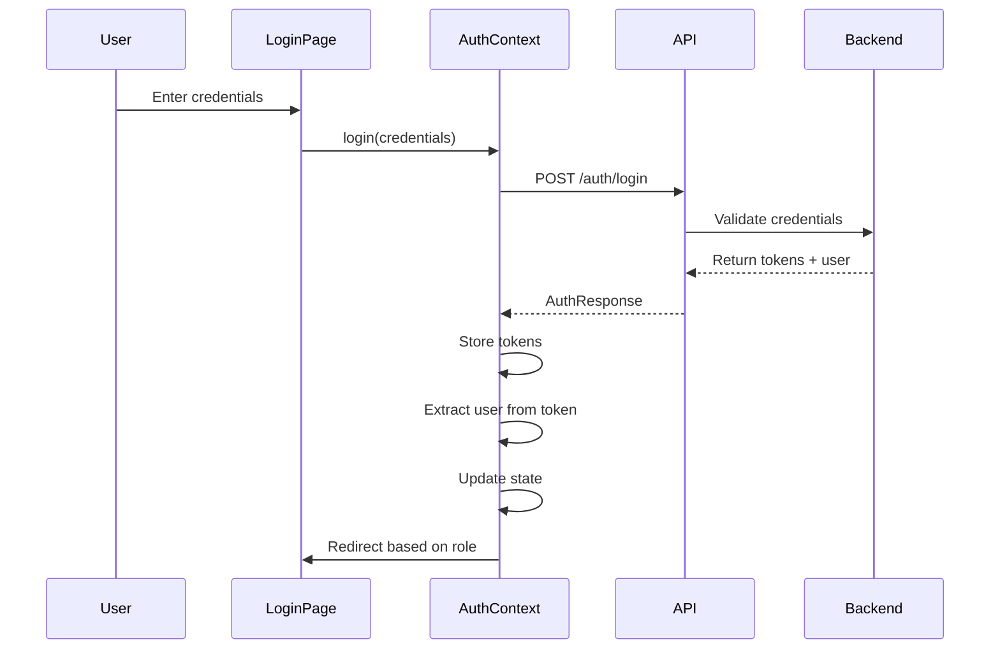
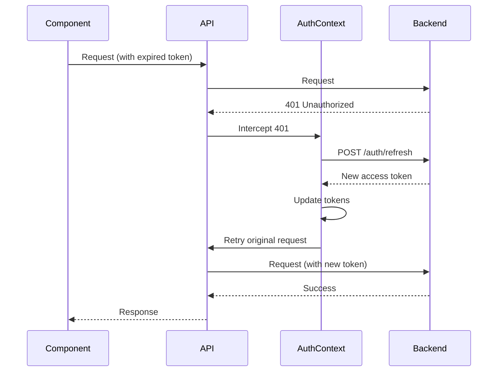
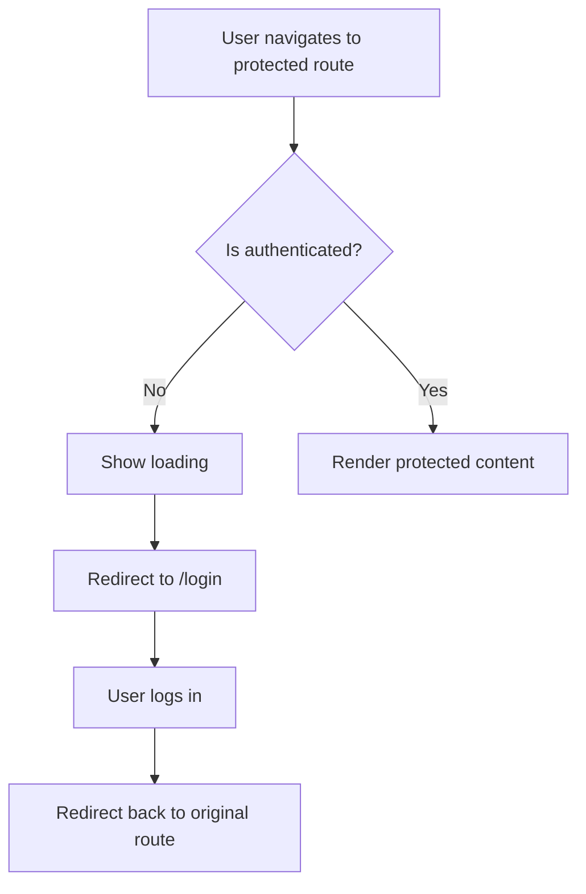

# Phase 2: Authentication Context & State Management - Complete

This document explains the authentication system we built for SkillBridge frontend.

---

## ✅ Components Created

### 1. Auth Types (`auth.ts`)

**Location:** `src/shared/types/auth.ts`

**Types Defined:**
- `AuthState` - Complete authentication state
- `LoginCredentials` - Login form data
- `RegisterData` - Registration form data (students/trainers)
- `AuthResponse` - API response with tokens and user
- `RefreshTokenResponse` - Token refresh response
- `AuthContextValue` - Context interface

**Key Features:**
- Type-safe authentication data structures
- Separate types for login vs registration
- Extensible for future auth features

---

### 2. AuthContext (`AuthContext.tsx`)

**Location:** `src/shared/contexts/AuthContext.tsx`

**Features:**
- **State Management**: 
  - User information
  - Access token (in memory + localStorage)
  - Refresh token (localStorage)
  - Loading states
  - Error handling

- **Authentication Methods**:
  - `login()` - Authenticate user
  - `register()` - Register new student/trainer
  - `logout()` - Clear tokens and redirect
  - `refreshAccessToken()` - Refresh expired access token
  - `clearError()` - Clear error state

- **Token Management**:
  - Automatic token storage in localStorage
  - Token expiration checking
  - JWT decoding to extract user info
  - Automatic token refresh on 401 errors

- **Initialization**:
  - Restores auth state from localStorage on mount
  - Validates token expiration
  - Attempts token refresh if access token expired

- **Role-Based Redirects**:
  - Automatically redirects after login based on user role
  - SYSTEM_ADMIN → `/admin/colleges`
  - COLLEGE_ADMIN → `/admin/dashboard`
  - TRAINER → `/trainer/dashboard`
  - STUDENT → `/student/dashboard`

**Token Storage Strategy:**
- **Access Token**: 
  - Stored in React state (memory)
  - Also stored in localStorage as backup
  - Key: `skillbridge_access_token`
  
- **Refresh Token**:
  - Stored in localStorage
  - Key: `skillbridge_refresh_token`
  
- **User Data**:
  - Stored in localStorage for persistence
  - Key: `skillbridge_user`

**JWT Handling:**
- Decodes JWT to extract user information
- Checks token expiration
- Extracts user ID, email, role, collegeId from token payload

**Error Handling:**
- Catches and displays authentication errors
- Handles network failures gracefully
- Clears state on critical errors

---

### 3. useAuth Hook (`useAuth.ts`)

**Location:** `src/shared/hooks/useAuth.ts`

**Purpose:**
- Convenience hook to access AuthContext
- Throws error if used outside AuthProvider
- Provides type-safe access to auth state and methods

**Usage:**
```typescript
const { user, isAuthenticated, login, logout } = useAuth()
```

---

### 4. ProtectedRoute Component (`ProtectedRoute.tsx`)

**Location:** `src/shared/components/auth/ProtectedRoute.tsx`

**Features:**
- **Route Guard**: Protects routes that require authentication
- **Loading State**: Shows spinner while checking authentication
- **Redirect**: Redirects to login if not authenticated
- **State Preservation**: Preserves intended destination in location state

**Usage:**
```tsx
<Route 
  path="/dashboard" 
  element={
    <ProtectedRoute>
      <DashboardPage />
    </ProtectedRoute>
  } 
/>
```

**Behavior:**
1. Checks if user is authenticated
2. Shows loading spinner while checking
3. Redirects to `/login` if not authenticated (with `from` state)
4. Renders children if authenticated

---

### 5. RoleGuard Component (`RoleGuard.tsx`)

**Location:** `src/shared/components/auth/RoleGuard.tsx`

**Features:**
- **Component-Level RBAC**: Restricts content based on user role
- **Multiple Roles**: Supports array of allowed roles
- **Flexible Rendering**: Can show 403 message or redirect
- **Loading State**: Shows spinner while checking

**Usage:**
```tsx
<RoleGuard allowedRoles={['SYSTEM_ADMIN', 'COLLEGE_ADMIN']}>
  <AdminOnlyContent />
</RoleGuard>
```

**Props:**
- `allowedRoles`: Array of roles that can access content
- `redirectTo`: Optional redirect path when access denied
- `showMessage`: Show 403 message instead of redirecting (default: true)

**Behavior:**
1. Checks if user has one of the allowed roles
2. Shows loading spinner while checking
3. Shows 403 message or redirects if access denied
4. Renders children if user has required role

---

## 🔧 API Integration

### Updated API Client (`client.ts`)

**Changes:**
- Updated token storage keys to match AuthContext
- Token interceptor uses `skillbridge_access_token`
- Removed automatic redirect on 401 (handled by AuthContext)

### Updated Auth API (`auth.ts`)

**Changes:**
- Updated `RegisterRequest` to include student/trainer fields
- Updated `AuthResponse` to include optional user object
- Added `getCurrentUser()` function
- Updated `logout()` to use correct token keys

---

## 📁 File Structure

```
src/shared/
├── types/
│   └── auth.ts                    # Auth-related types
├── contexts/
│   └── AuthContext.tsx           # Authentication context
├── hooks/
│   └── useAuth.ts                # useAuth hook
└── components/
    └── auth/
        ├── ProtectedRoute.tsx     # Route guard
        ├── RoleGuard.tsx          # Role-based access control
        └── index.ts               # Exports
```

---

## 🎯 Design Principles Applied

### 1. **Separation of Concerns**
- Auth logic in context
- Route protection in components
- API calls in separate module

### 2. **Type Safety**
- Full TypeScript coverage
- Proper interfaces for all data structures
- Type-safe context access

### 3. **Security Best Practices**
- Access token in memory (reduces XSS risk)
- Refresh token in localStorage (for persistence)
- Automatic token refresh
- Token expiration checking

### 4. **User Experience**
- Loading states during auth checks
- Clear error messages
- Automatic redirects based on role
- State preservation (redirect back after login)

### 5. **Error Handling**
- Graceful error handling
- User-friendly error messages
- Automatic cleanup on errors

---

## 🔄 Authentication Flow

### Login Flow



### Token Refresh Flow



### Protected Route Flow



---

## 📝 Usage Examples

### Using AuthContext in Components

```tsx
import { useAuth } from '@/shared/hooks/useAuth'

function MyComponent() {
  const { user, isAuthenticated, login, logout } = useAuth()

  if (!isAuthenticated) {
    return <div>Please login</div>
  }

  return (
    <div>
      <p>Welcome, {user?.email}</p>
      <button onClick={logout}>Logout</button>
    </div>
  )
}
```

### Protecting Routes

```tsx
import { Routes, Route } from 'react-router-dom'
import { ProtectedRoute } from '@/shared/components/auth'
import DashboardPage from './pages/Dashboard'

function App() {
  return (
    <Routes>
      <Route 
        path="/dashboard" 
        element={
          <ProtectedRoute>
            <DashboardPage />
          </ProtectedRoute>
        } 
      />
    </Routes>
  )
}
```

### Role-Based Access Control

```tsx
import { RoleGuard } from '@/shared/components/auth'

function AdminPage() {
  return (
    <RoleGuard allowedRoles={['SYSTEM_ADMIN', 'COLLEGE_ADMIN']}>
      <div>Admin content</div>
    </RoleGuard>
  )
}
```

### Login Implementation

```tsx
import { useAuth } from '@/shared/hooks/useAuth'
import { useState } from 'react'

function LoginPage() {
  const { login, isLoading, error } = useAuth()
  const [email, setEmail] = useState('')
  const [password, setPassword] = useState('')

  const handleSubmit = async (e: React.FormEvent) => {
    e.preventDefault()
    try {
      await login({ email, password })
    } catch (error) {
      // Error is handled by AuthContext
    }
  }

  return (
    <form onSubmit={handleSubmit}>
      {error && <div className="error">{error}</div>}
      <input 
        type="email" 
        value={email} 
        onChange={(e) => setEmail(e.target.value)} 
      />
      <input 
        type="password" 
        value={password} 
        onChange={(e) => setPassword(e.target.value)} 
      />
      <button type="submit" disabled={isLoading}>
        {isLoading ? 'Logging in...' : 'Login'}
      </button>
    </form>
  )
}
```

---

## 🔐 Security Considerations

### Token Storage

1. **Access Token**:
   - Stored in React state (memory) - primary
   - Also in localStorage - backup
   - Short-lived (15 minutes typically)
   - Reduces XSS attack surface

2. **Refresh Token**:
   - Stored in localStorage
   - Long-lived (7 days typically)
   - Used only for token refresh
   - Can be revoked server-side

### Token Refresh

- Automatic refresh on 401 errors
- Prevents user interruption
- Handles refresh failures gracefully
- Redirects to login if refresh fails

### JWT Validation

- Decodes and validates token structure
- Checks expiration before use
- Extracts user info from token payload
- Handles malformed tokens gracefully

---

## 🧪 Testing Checklist

- [x] AuthContext initializes correctly
- [x] Login function works
- [x] Logout function clears state
- [x] Token refresh works automatically
- [x] ProtectedRoute redirects when not authenticated
- [x] ProtectedRoute renders when authenticated
- [x] RoleGuard shows 403 for wrong role
- [x] RoleGuard renders for correct role
- [x] Token expiration is checked
- [x] User info extracted from JWT
- [x] Role-based redirects work
- [x] Error handling works
- [x] Loading states display correctly
- [x] No TypeScript errors
- [x] No linting errors

---

## 🚀 Next Steps (Phase 3)

1. **Public Pages**: Create Landing, Login, Register pages
2. **Connect Layout**: Use AuthContext in Layout component
3. **Update App Routes**: Add all routes with protection
4. **Test Authentication**: Test full login/logout flow

---

## 📚 Key Learnings

1. **Context Pattern**: React Context is perfect for global auth state
2. **Token Management**: Balance between security and UX
3. **JWT Handling**: Decode tokens client-side for user info
4. **Error Handling**: Graceful degradation improves UX
5. **Type Safety**: TypeScript prevents many runtime errors

---

## 🎉 Phase 2 Complete!

All authentication components are:
- ✅ Fully implemented with best practices
- ✅ Type-safe with TypeScript
- ✅ Secure token management
- ✅ Automatic token refresh
- ✅ Role-based access control
- ✅ Ready for integration with pages

**Ready to proceed to Phase 3: Public Pages (Landing, Login, Register)!**

