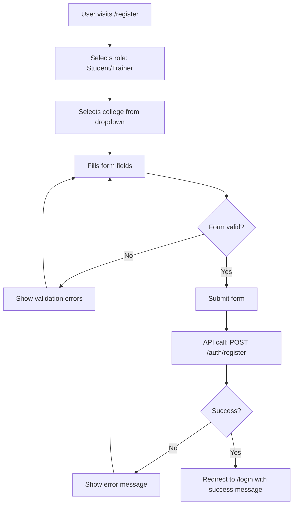
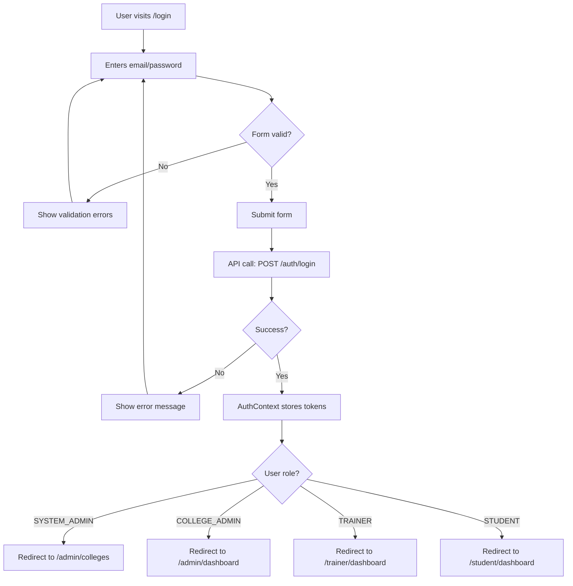

# Phase 3: Public Pages - Complete

This document explains the public pages we built for SkillBridge frontend.

---

## ✅ Pages Created

### 1. Landing Page (`Landing.tsx`)

**Location:** `src/pages/Landing.tsx`

**Features:**
- **Hero Section**:
  - Compelling headline
  - Value proposition
  - Call-to-action buttons (Get Started, Login)
  
- **Features Section**:
  - 4 key features with icons:
    - Student Management
    - Trainer Coordination
    - Smart Recommendations
    - Placement Tracking
  
- **CTA Section**:
  - Final call-to-action
  - Link to registration

- **Design**:
  - Clean, modern layout
  - Responsive design
  - Uses shadcn/ui components
  - Lucide React icons

**Components Used:**
- Header (without sidebar)
- Button
- Card (for features)

---

### 2. Login Page (`Login.tsx`)

**Location:** `src/pages/auth/Login.tsx`

**Features:**
- **Form Fields**:
  - Email (with validation)
  - Password (with validation)
  
- **Form Validation**:
  - React Hook Form integration
  - Zod schema validation
  - Real-time error messages
  
- **User Experience**:
  - Loading states during login
  - Error messages (from API or local)
  - "Forgot password?" link (placeholder)
  - Link to registration page
  - Auto-redirect if already authenticated
  - Preserves intended destination after login

- **Integration**:
  - Uses `useAuth` hook
  - Calls `login()` from AuthContext
  - Automatic role-based redirect after login

**Validation Rules:**
- Email: Must be valid email format
- Password: Required

**Error Handling:**
- Displays API errors
- Shows validation errors
- Clears errors on component mount

---

### 3. Register Page (`Register.tsx`)

**Location:** `src/pages/auth/Register.tsx`

**Features:**
- **Role Selection**:
  - Radio buttons for Student/Trainer
  - Dynamic form based on selected role
  
- **College Selection**:
  - Dropdown populated from API
  - Fetches active colleges using React Query
  - Loading and error states
  
- **Common Fields**:
  - Full Name (required)
  - Email (required, validated)
  - Password (required, strong password rules)
  - Confirm Password (must match)
  
- **Student-Specific Fields**:
  - Roll Number (required)
  - Degree (optional)
  - Branch (optional)
  - Year (optional, 1-10)
  
- **Trainer-Specific Fields**:
  - Department (optional)
  - Specialization (optional)
  - Bio (optional)
  
- **Form Validation**:
  - Dynamic Zod schema based on role
  - Password strength requirements:
    - Minimum 8 characters
    - Uppercase letter
    - Lowercase letter
    - Number
    - Special character
  - Password confirmation matching
  - Real-time validation errors

- **User Experience**:
  - Loading states
  - Error messages
  - Link to login page
  - Success redirect to login (with message)

**Validation Rules:**
- Email: Valid email format
- Password: Strong password (8+ chars, uppercase, lowercase, number, special char)
- Confirm Password: Must match password
- Full Name: Required
- College: Required selection
- Roll Number: Required (Student only)

**API Integration:**
- Fetches colleges from `/api/v1/colleges/active`
- Uses React Query for caching and loading states

---

## 🔧 API Integration

### College API (`college.ts`)

**Location:** `src/api/college.ts`

**Functions:**
- `getColleges()` - Fetches all active colleges

**Endpoint:** `GET /api/v1/colleges/active`

**Usage:**
```typescript
import { getColleges } from '@/api/college'
import { useQuery } from '@tanstack/react-query'

const { data: colleges, isLoading } = useQuery({
  queryKey: ['colleges'],
  queryFn: getColleges,
})
```

---

## 📁 File Structure

```
src/
├── pages/
│   ├── Landing.tsx              # ✅ Landing page
│   └── auth/
│       ├── Login.tsx            # ✅ Login page
│       └── Register.tsx         # ✅ Register page
├── api/
│   └── college.ts               # ✅ College API
└── App.tsx                      # ✅ Updated with routes
```

---

## 🎯 Design Principles Applied

### 1. **Form Validation**
- Client-side validation with Zod
- Real-time error feedback
- Clear error messages
- Prevents invalid submissions

### 2. **User Experience**
- Loading states during API calls
- Error handling with user-friendly messages
- Success feedback
- Smooth navigation flows

### 3. **Accessibility**
- Proper form labels
- ARIA attributes
- Keyboard navigation
- Screen reader support

### 4. **Responsive Design**
- Mobile-first approach
- Works on all screen sizes
- Touch-friendly buttons
- Readable text

### 5. **Type Safety**
- Full TypeScript coverage
- Type-safe form data
- Type-safe API calls
- Type-safe navigation

---

## 🔄 User Flows

### Registration Flow



### Login Flow



---

## 📝 Usage Examples

### Landing Page

```tsx
import { Landing } from '@/pages/Landing'

// Used in routes
<Route path="/" element={<Landing />} />
```

### Login Page

```tsx
import { Login } from '@/pages/auth/Login'

// Used in routes
<Route path="/login" element={<Login />} />
```

### Register Page

```tsx
import { Register } from '@/pages/auth/Register'

// Used in routes
<Route path="/register" element={<Register />} />
```

---

## 🧪 Testing Checklist

- [x] Landing page renders correctly
- [x] Login form validates email format
- [x] Login form validates password required
- [x] Login shows error on invalid credentials
- [x] Login redirects based on role
- [x] Register form validates all fields
- [x] Register form shows role-specific fields
- [x] Register form validates password strength
- [x] Register form validates password match
- [x] Register fetches colleges from API
- [x] Register shows loading states
- [x] Register shows error messages
- [x] All forms are accessible
- [x] All pages are responsive
- [x] No TypeScript errors
- [x] No linting errors

---

## 🚀 Next Steps (Phase 4)

1. **System Admin Pages**:
   - Colleges list page
   - Create college page
   - Create college admin page

2. **College Admin Dashboard**:
   - Overview with stats
   - Batches management
   - Companies management
   - Trainers management
   - Students management

3. **Connect Layout**:
   - Use Layout component with AuthContext
   - Show sidebar based on authentication
   - Show user menu in header

---

## 📚 Key Learnings

1. **Form Validation**: Zod + React Hook Form provides excellent DX
2. **Dynamic Forms**: Conditional fields based on user selection
3. **API Integration**: React Query simplifies data fetching
4. **Error Handling**: User-friendly error messages improve UX
5. **Type Safety**: TypeScript prevents many runtime errors

---

## 🎉 Phase 3 Complete!

All public pages are:
- ✅ Fully implemented with best practices
- ✅ Form validation with Zod
- ✅ Error handling
- ✅ Loading states
- ✅ Responsive design
- ✅ Accessible
- ✅ Integrated with AuthContext
- ✅ Ready for backend integration

**Ready to proceed to Phase 4: System Admin Pages!**

