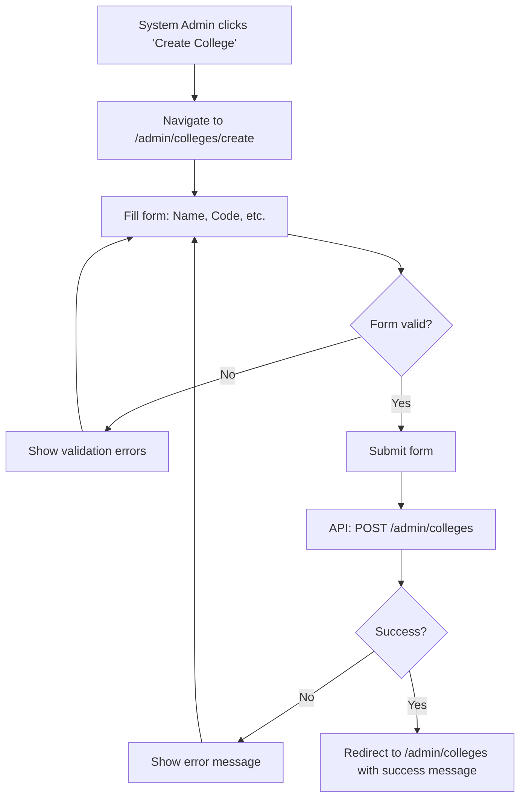

# Phase 4: System Admin Pages - Complete

This document explains the System Admin pages we built for SkillBridge frontend.

---

## ✅ Components Created

### 1. Admin API (`admin.ts`)

**Location:** `src/api/admin.ts`

**Functions:**
- `getAllColleges()` - Get all colleges (System Admin only)
- `getCollegeById(id)` - Get college by ID
- `createCollege(data)` - Create a new college
- `updateCollege(id, data)` - Update college information
- `updateCollegeStatus(id, status)` - Activate/Deactivate college
- `createCollegeAdmin(collegeId, data)` - Create college admin account

**Types:**
- `CreateCollegeRequest` - College creation payload
- `CreateCollegeAdminRequest` - Admin creation payload
- `CreateCollegeAdminResponse` - Admin creation response

**Key Features:**
- All endpoints require SYSTEM_ADMIN role (enforced by backend)
- Type-safe API calls
- Proper error handling

---

### 2. AuthenticatedLayout Component (`AuthenticatedLayout.tsx`)

**Location:** `src/shared/components/layout/AuthenticatedLayout.tsx`

**Purpose:**
- Wrapper component that connects Layout to AuthContext
- Automatically provides user data and logout handler
- Shows sidebar for authenticated users
- Simplifies usage in protected pages

**Features:**
- Extracts user info from AuthContext
- Formats user name from email
- Handles logout
- Shows sidebar based on authentication

**Usage:**
```tsx
<AuthenticatedLayout>
  <YourPageContent />
</AuthenticatedLayout>
```

---

### 3. Colleges List Page (`CollegesList.tsx`)

**Location:** `src/pages/admin/colleges/CollegesList.tsx`

**Features:**
- **Table Display**:
  - Shows all colleges in a sortable table
  - Columns: Name, Code, Email, Phone, Status, Actions
  - Status badges (ACTIVE/INACTIVE)
  - Empty state when no colleges

- **Search Functionality**:
  - Real-time search by name, code, or email
  - Debounced search input
  - Shows filtered count

- **Actions**:
  - View Details (dropdown menu)
  - Activate/Deactivate college
  - Create College button

- **Data Management**:
  - React Query for data fetching
  - Automatic cache invalidation on mutations
  - Loading states
  - Error handling

- **User Experience**:
  - Loading spinner during fetch
  - Error alerts
  - Confirmation dialogs for status changes
  - Empty state with call-to-action

**Components Used:**
- Table (shadcn/ui)
- Badge (status indicators)
- DropdownMenu (actions)
- Card (container)
- Input (search)

---

### 4. Create College Page (`CreateCollege.tsx`)

**Location:** `src/pages/admin/colleges/CreateCollege.tsx`

**Features:**
- **Form Fields**:
  - Name (required, max 255 chars)
  - Code (required, max 50 chars, uppercase only, alphanumeric + hyphens/underscores)
  - Email (optional, validated)
  - Phone (optional, max 20 chars)
  - Address (optional, max 500 chars)

- **Form Validation**:
  - React Hook Form + Zod
  - Real-time validation
  - Clear error messages
  - Code auto-uppercase conversion

- **User Experience**:
  - Loading states during submission
  - Error alerts
  - Success redirect with message
  - Cancel button
  - Back navigation

- **Business Logic**:
  - Code must be unique (validated by backend)
  - Code automatically converted to uppercase
  - Optional fields handled properly

**Validation Rules:**
- Name: Required, 1-255 characters
- Code: Required, 1-50 characters, uppercase alphanumeric + hyphens/underscores
- Email: Optional, valid email format
- Phone: Optional, max 20 characters
- Address: Optional, max 500 characters

---

### 5. Create College Admin Page (`CreateCollegeAdmin.tsx`)

**Location:** `src/pages/admin/admins/CreateCollegeAdmin.tsx`

**Features:**
- **College Selection**:
  - Dropdown populated with active colleges
  - Fetched using React Query
  - Loading and error states
  - Shows selected college name

- **Form Fields**:
  - College (required, dropdown)
  - Full Name (required)
  - Email (required, validated)
  - Password (required, strong password rules)
  - Confirm Password (required, must match)
  - Phone (optional)

- **Form Validation**:
  - React Hook Form + Zod
  - Password strength requirements
  - Password confirmation matching
  - Real-time validation

- **User Experience**:
  - Loading states
  - Error alerts
  - Success message with auto-redirect
  - Cancel button
  - Back navigation

- **Business Logic**:
  - Only one admin per college (enforced by backend)
  - Only active colleges shown
  - Strong password requirements

**Validation Rules:**
- College: Required selection
- Full Name: Required
- Email: Required, valid email format
- Password: Required, 8+ chars, uppercase, lowercase, number, special char
- Confirm Password: Required, must match password
- Phone: Optional, max 20 characters

---

## 📁 File Structure

```
src/
├── api/
│   └── admin.ts                          # ✅ New - Admin API
├── pages/
│   └── admin/
│       ├── colleges/
│       │   ├── CollegesList.tsx          # ✅ New
│       │   └── CreateCollege.tsx         # ✅ New
│       └── admins/
│           └── CreateCollegeAdmin.tsx    # ✅ New
└── shared/
    └── components/
        └── layout/
            └── AuthenticatedLayout.tsx   # ✅ New
```

---

## 🎯 Design Principles Applied

### 1. **Separation of Concerns**
- API calls in separate module
- Form logic separated from UI
- Layout wrapper for reusability
- Role-based access control

### 2. **Type Safety**
- Full TypeScript coverage
- Type-safe API calls
- Type-safe form data
- Proper error types

### 3. **User Experience**
- Loading states during operations
- Error handling with clear messages
- Success feedback
- Confirmation dialogs for destructive actions
- Empty states with helpful messages

### 4. **Data Management**
- React Query for server state
- Automatic cache invalidation
- Optimistic updates where appropriate
- Error retry logic

### 5. **Form Validation**
- Client-side validation with Zod
- Real-time error feedback
- Clear validation messages
- Prevents invalid submissions

### 6. **Accessibility**
- Proper form labels
- ARIA attributes
- Keyboard navigation
- Screen reader support

---

## 🔄 User Flows

### Create College Flow



### Create College Admin Flow

```mermaid
flowchart TD
    A[System Admin clicks 'Create Admin'] --> B[Navigate to /admin/admins/create]
    B --> C[Select college from dropdown]
    C --> D[Fill form: Name, Email, Password, etc.]
    D --> E{Form valid?}
    E -->|No| F[Show validation errors]
    F --> D
    E -->|Yes| G[Submit form]
    G --> H[API: POST /admin/colleges/{id}/admins]
    H --> I{Success?}
    I -->|No| J[Show error message]
    J --> D
    I -->|Yes| K[Show success message]
    K --> L[Auto-redirect to /admin/colleges after 2s]
```

### Manage Colleges Flow

```mermaid
flowchart TD
    A[System Admin views colleges list] --> B[Search/filter colleges]
    B --> C[View college details]
    C --> D{Action?}
    D -->|Edit| E[Navigate to edit page]
    D -->|Deactivate| F[Confirm action]
    F --> G[API: PATCH /admin/colleges/{id}/status]
    G --> H[Update table]
    D -->|Create Admin| I[Navigate to create admin]
```

---

## 📝 Usage Examples

### Using AuthenticatedLayout

```tsx
import { AuthenticatedLayout } from '@/shared/components/layout'
import { RoleGuard } from '@/shared/components/auth'

function MyPage() {
  return (
    <RoleGuard allowedRoles={['SYSTEM_ADMIN']}>
      <AuthenticatedLayout>
        <div>Page content</div>
      </AuthenticatedLayout>
    </RoleGuard>
  )
}
```

### Using Admin API

```tsx
import { useQuery, useMutation } from '@tanstack/react-query'
import { getAllColleges, createCollege } from '@/api/admin'

function MyComponent() {
  const { data: colleges, isLoading } = useQuery({
    queryKey: ['admin', 'colleges'],
    queryFn: getAllColleges,
  })

  const mutation = useMutation({
    mutationFn: createCollege,
    onSuccess: () => {
      // Handle success
    },
  })

  // Use colleges and mutation
}
```

---

## 🧪 Testing Checklist

- [x] Colleges list page renders correctly
- [x] Search functionality works
- [x] Table displays all colleges
- [x] Status badges show correctly
- [x] Actions dropdown works
- [x] Status toggle works with confirmation
- [x] Create college form validates correctly
- [x] Create college form submits successfully
- [x] Code field auto-uppercases
- [x] Create admin form validates correctly
- [x] Create admin form submits successfully
- [x] College dropdown loads active colleges
- [x] Password validation works
- [x] Password confirmation matching works
- [x] Error handling works
- [x] Loading states display correctly
- [x] Success messages show
- [x] RoleGuard restricts access
- [x] AuthenticatedLayout shows sidebar
- [x] No TypeScript errors
- [x] No linting errors

---

## 🚀 Next Steps (Phase 5)

1. **College Admin Dashboard**:
   - Overview with statistics
   - Quick actions
   - Recent activity

2. **College Admin Pages**:
   - Batches management
   - Companies management
   - Trainers management
   - Students management

3. **Enhancements**:
   - Toast notifications for success/error
   - Pagination for large lists
   - Advanced filtering
   - Export functionality

---

## 📚 Key Learnings

1. **Layout Wrapper**: AuthenticatedLayout simplifies protected page structure
2. **React Query**: Excellent for server state management and caching
3. **Form Validation**: Zod + React Hook Form provides excellent DX
4. **Error Handling**: User-friendly error messages improve UX
5. **Role-Based Access**: RoleGuard ensures proper authorization
6. **Data Invalidation**: Automatic cache updates keep UI in sync

---

## 🎉 Phase 4 Complete!

All System Admin pages are:
- ✅ Fully implemented with best practices
- ✅ Form validation with Zod
- ✅ Error handling
- ✅ Loading states
- ✅ Role-based access control
- ✅ Responsive design
- ✅ Accessible
- ✅ Integrated with AuthContext
- ✅ Ready for backend integration

**Ready to proceed to Phase 5: College Admin Dashboard!**

