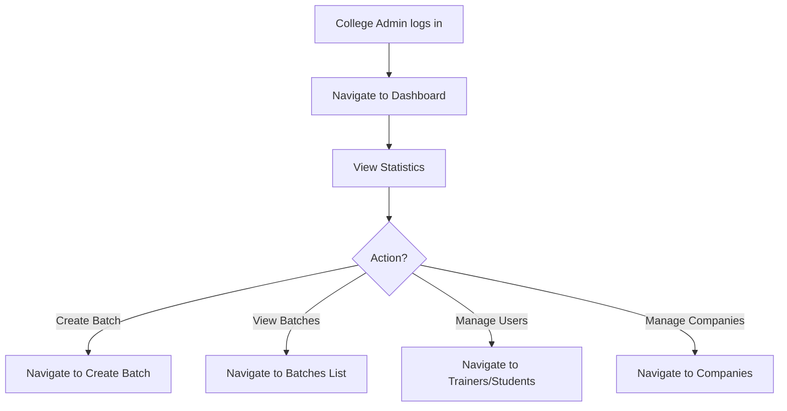
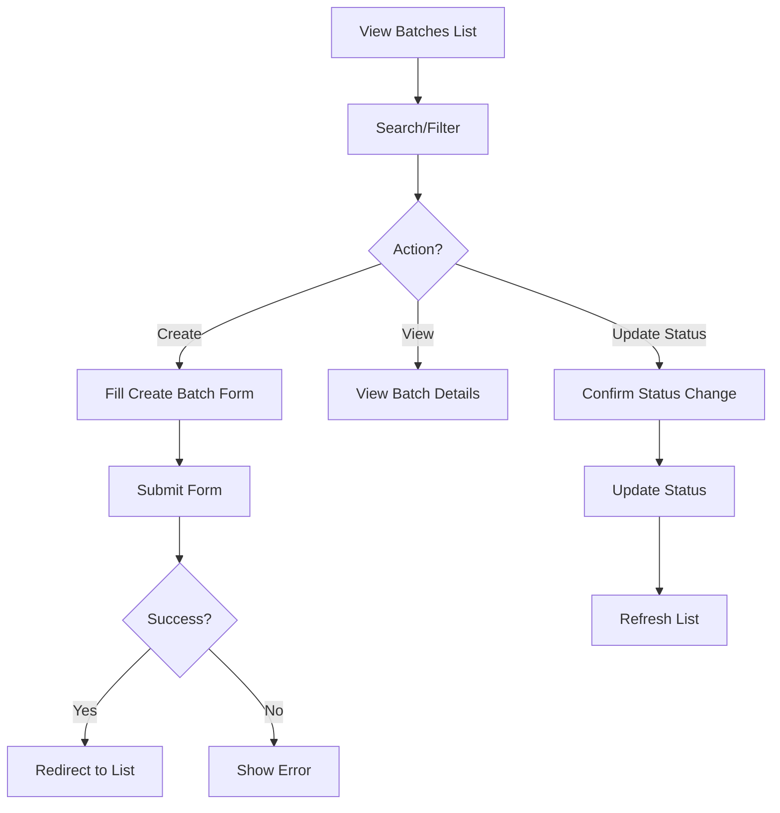
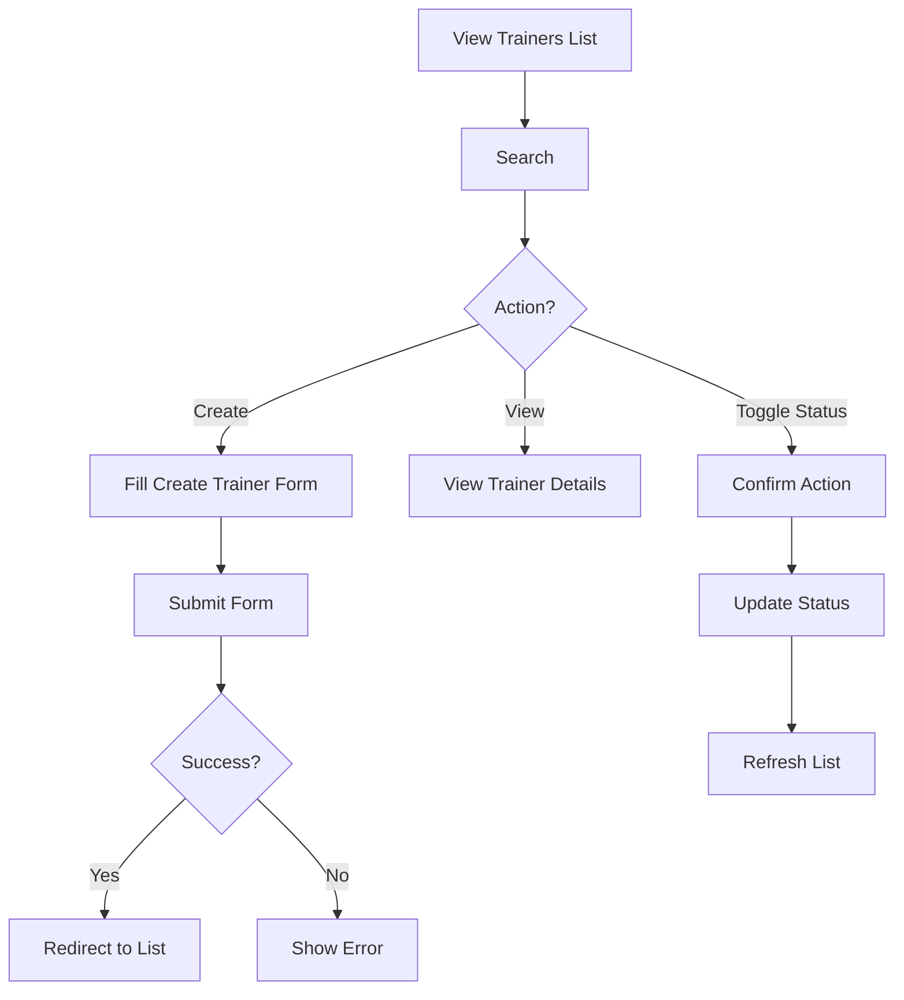

# Phase 5: College Admin Dashboard & Management Pages - Complete

This document explains the College Admin pages we built for SkillBridge frontend.

---

## ✅ Components Created

### 1. College Admin API (`college-admin.ts`)

**Location:** `src/api/college-admin.ts`

**Functions:**

#### Dashboard:
- `getDashboardStats()` - Get overview statistics

#### Batches:
- `getBatches()` - Get all batches with details
- `getBatchById(id)` - Get batch by ID
- `createBatch(data)` - Create new batch
- `updateBatch(id, data)` - Update batch
- `updateBatchStatus(id, status)` - Change batch status

#### Companies:
- `getCompanies()` - Get all companies
- `getCompanyById(id)` - Get company by ID
- `createCompany(data)` - Create new company
- `updateCompany(id, data)` - Update company
- `linkCompanyToBatch(companyId, batchId)` - Link company to batch
- `unlinkCompanyFromBatch(companyId, batchId)` - Unlink company from batch

#### Trainers:
- `getTrainers()` - Get all trainers
- `getTrainerById(id)` - Get trainer by ID
- `createTrainer(data)` - Create new trainer account
- `updateTrainer(id, data)` - Update trainer
- `updateTrainerStatus(id, isActive)` - Activate/Deactivate trainer
- `assignTrainerToBatch(trainerId, batchId)` - Assign trainer to batch
- `unassignTrainerFromBatch(trainerId, batchId)` - Unassign trainer from batch

#### Students:
- `getStudents()` - Get all students with details
- `getStudentById(id)` - Get student by ID
- `updateStudent(id, data)` - Update student info
- `updateStudentStatus(id, isActive)` - Activate/Deactivate student

#### Batch Enrollments:
- `getBatchEnrollments(batchId)` - Get enrollments for a batch
- `approveEnrollment(batchId, enrollmentId)` - Approve student enrollment
- `rejectEnrollment(batchId, enrollmentId)` - Reject student enrollment

**Key Features:**
- All endpoints scoped to college admin's college
- Type-safe API calls
- Comprehensive error handling
- Proper TypeScript interfaces

---

### 2. Dashboard (`Dashboard.tsx`)

**Location:** `src/pages/admin/dashboard/Dashboard.tsx`

**Features:**
- **Statistics Cards**:
  - Total Batches (with active count)
  - Total Students
  - Total Trainers
  - Total Companies
  - Clickable cards linking to respective pages

- **Quick Actions Card**:
  - Create Batch button
  - Add Trainer button
  - Add Company button

- **Management Links Card**:
  - Quick links to all management pages
  - Batches, Students, Trainers, Companies

- **Analytics Card**:
  - Placeholder for future reporting features

- **Recent Activity**:
  - Shows recent updates (if available from API)
  - Timestamp display

**Data Management:**
- React Query for data fetching
- Loading states
- Error handling
- Automatic cache management

---

### 3. Batches List Page (`BatchesList.tsx`)

**Location:** `src/pages/admin/batches/BatchesList.tsx`

**Features:**
- **Table Display**:
  - Shows all batches in a sortable table
  - Columns: Name, Status, Students, Trainers, Companies, Dates, Actions
  - Status badges with color coding
  - Count indicators for students, trainers, companies

- **Search & Filter**:
  - Real-time search by name or description
  - Status filter dropdown (All, Upcoming, Open, Active, Completed, Cancelled)
  - Combined filtering

- **Actions**:
  - View Details (dropdown menu)
  - Update Status (progressive: Upcoming → Open → Active → Completed)
  - Create Batch button

- **User Experience**:
  - Loading spinner
  - Error alerts
  - Empty state with call-to-action
  - Confirmation dialogs for status changes

**Status Flow:**
- UPCOMING → OPEN → ACTIVE → COMPLETED/CANCELLED
- Status badges with appropriate colors

---

### 4. Create Batch Page (`CreateBatch.tsx`)

**Location:** `src/pages/admin/batches/CreateBatch.tsx`

**Features:**
- **Form Fields**:
  - Name (required, max 255 chars)
  - Description (optional, max 1000 chars, textarea)
  - Start Date (optional, date picker)
  - End Date (optional, date picker)
  - Max Enrollments (optional, number)

- **Form Validation**:
  - React Hook Form + Zod
  - Real-time validation
  - End date must be after start date
  - Max enrollments must be positive number

- **User Experience**:
  - Loading states
  - Error alerts
  - Success redirect
  - Cancel button
  - Back navigation

**Business Logic:**
- Dates are optional (can be set later)
- Max enrollments limit student capacity
- Description helps trainers and students understand batch content

---

### 5. Companies List Page (`CompaniesList.tsx`)

**Location:** `src/pages/admin/companies/CompaniesList.tsx`

**Features:**
- **Table Display**:
  - Shows all companies
  - Columns: Name, Domain, Hiring Type, Linked Batches, Actions
  - Clickable domain links
  - Hiring type badges

- **Search**:
  - Real-time search by name or domain

- **Actions**:
  - View Details (dropdown menu)
  - Create Company button

- **User Experience**:
  - Loading states
  - Error alerts
  - Empty state with call-to-action

**Hiring Types:**
- FULL_TIME - Full-time positions only
- INTERNSHIP - Internship positions only
- BOTH - Both full-time and internship

---

### 6. Create Company Page (`CreateCompany.tsx`)

**Location:** `src/pages/admin/companies/CreateCompany.tsx`

**Features:**
- **Form Fields**:
  - Name (required, max 255 chars)
  - Domain (optional, validated format)
  - Hiring Type (required, dropdown: Full Time, Internship, Both)
  - Hiring Process (optional, max 1000 chars, textarea)
  - Notes (optional, max 1000 chars, textarea)

- **Form Validation**:
  - React Hook Form + Zod
  - Domain format validation (e.g., example.com)
  - Real-time error feedback

- **User Experience**:
  - Loading states
  - Error alerts
  - Success redirect
  - Cancel button
  - Back navigation

**Business Logic:**
- Domain is optional but validated if provided
- Hiring type determines what positions company offers
- Hiring process helps students understand application steps

---

### 7. Trainers List Page (`TrainersList.tsx`)

**Location:** `src/pages/admin/trainers/TrainersList.tsx`

**Features:**
- **Table Display**:
  - Shows all trainers
  - Columns: Name, Email, Department, Specialization, Assigned Batches, Status, Actions
  - Status badges (Active/Inactive)
  - Batch assignment count

- **Search**:
  - Real-time search by name, email, department, or specialization

- **Actions**:
  - View Details (dropdown menu)
  - Activate/Deactivate trainer
  - Create Trainer button

- **User Experience**:
  - Loading states
  - Error alerts
  - Empty state with call-to-action
  - Confirmation dialogs for status changes

---

### 8. Create Trainer Page (`CreateTrainer.tsx`)

**Location:** `src/pages/admin/trainers/CreateTrainer.tsx`

**Features:**
- **Form Fields**:
  - Full Name (required, max 255 chars)
  - Email (required, validated)
  - Password (required, strong password rules)
  - Confirm Password (required, must match)
  - Phone (optional, max 20 chars)
  - Department (optional, max 255 chars)
  - Specialization (optional, max 255 chars)
  - Bio (optional, max 1000 chars, textarea)

- **Form Validation**:
  - React Hook Form + Zod
  - Strong password requirements
  - Password confirmation matching
  - Real-time validation

- **User Experience**:
  - Loading states
  - Error alerts
  - Success redirect
  - Cancel button
  - Back navigation

**Password Requirements:**
- Minimum 8 characters
- At least one uppercase letter
- At least one lowercase letter
- At least one number
- At least one special character

---

### 9. Students List Page (`StudentsList.tsx`)

**Location:** `src/pages/admin/students/StudentsList.tsx`

**Features:**
- **Table Display**:
  - Shows all students
  - Columns: Roll Number, Email, Degree, Branch, Year, Enrolled Batches, Status, Actions
  - Status badges (Active/Inactive)
  - Batch enrollment count

- **Search**:
  - Real-time search by roll number, email, degree, or branch

- **Actions**:
  - View Details (dropdown menu)
  - Activate/Deactivate student

- **User Experience**:
  - Loading states
  - Error alerts
  - Empty state (students register themselves)

**Note:**
- Students register themselves (not created by admin)
- Admin can view, update, and manage student status
- Students appear after they complete registration

---

## 📁 File Structure

```
src/
├── api/
│   └── college-admin.ts                    # ✅ New - College Admin API
├── pages/
│   └── admin/
│       ├── dashboard/
│       │   └── Dashboard.tsx               # ✅ New
│       ├── batches/
│       │   ├── BatchesList.tsx             # ✅ New
│       │   └── CreateBatch.tsx             # ✅ New
│       ├── companies/
│       │   ├── CompaniesList.tsx           # ✅ New
│       │   └── CreateCompany.tsx           # ✅ New
│       ├── trainers/
│       │   ├── TrainersList.tsx            # ✅ New
│       │   └── CreateTrainer.tsx           # ✅ New
│       └── students/
│           └── StudentsList.tsx            # ✅ New
└── App.tsx                                  # ✅ Updated with routes
```

---

## 🎯 Design Principles Applied

### 1. **Separation of Concerns**
- API layer separate from UI
- Reusable components
- Clear page structure
- Role-based access control

### 2. **Type Safety**
- Full TypeScript coverage
- Type-safe API calls
- Type-safe form data
- Proper error types

### 3. **User Experience**
- Consistent loading states
- Clear error messages
- Success feedback
- Confirmation dialogs
- Empty states with helpful messages
- Search and filter capabilities

### 4. **Data Management**
- React Query for server state
- Automatic cache invalidation
- Optimistic updates where appropriate
- Error retry logic

### 5. **Form Validation**
- Client-side validation with Zod
- Real-time error feedback
- Clear validation messages
- Prevents invalid submissions

### 6. **Accessibility**
- Proper form labels
- ARIA attributes
- Keyboard navigation
- Screen reader support

### 7. **Code Quality**
- Consistent naming conventions
- Reusable components
- DRY principles
- Clean code structure
- Proper error handling

---

## 🔄 User Flows

### Dashboard Flow



### Batch Management Flow



### Trainer Management Flow



---

## 📝 Usage Examples

### Using College Admin API

```tsx
import { useQuery, useMutation } from '@tanstack/react-query'
import { getBatches, createBatch } from '@/api/college-admin'

function MyComponent() {
  const { data: batches, isLoading } = useQuery({
    queryKey: ['admin', 'batches'],
    queryFn: getBatches,
  })

  const mutation = useMutation({
    mutationFn: createBatch,
    onSuccess: () => {
      // Handle success
    },
  })

  // Use batches and mutation
}
```

### Dashboard Statistics

```tsx
import { useQuery } from '@tanstack/react-query'
import { getDashboardStats } from '@/api/college-admin'

function Dashboard() {
  const { data: stats } = useQuery({
    queryKey: ['admin', 'dashboard', 'stats'],
    queryFn: getDashboardStats,
  })

  return (
    <div>
      <p>Total Batches: {stats?.totalBatches}</p>
      <p>Active Batches: {stats?.activeBatches}</p>
      <p>Total Students: {stats?.totalStudents}</p>
    </div>
  )
}
```

---

## 🧪 Testing Checklist

- [x] Dashboard loads statistics correctly
- [x] Statistics cards are clickable
- [x] Quick actions work
- [x] Batches list displays correctly
- [x] Batch search works
- [x] Batch status filter works
- [x] Create batch form validates correctly
- [x] Create batch form submits successfully
- [x] Companies list displays correctly
- [x] Company search works
- [x] Create company form validates correctly
- [x] Create company form submits successfully
- [x] Trainers list displays correctly
- [x] Trainer search works
- [x] Create trainer form validates correctly
- [x] Create trainer form submits successfully
- [x] Students list displays correctly
- [x] Student search works
- [x] Status toggles work with confirmation
- [x] Error handling works
- [x] Loading states display correctly
- [x] Empty states show correctly
- [x] RoleGuard restricts access
- [x] All routes configured correctly
- [x] No TypeScript errors
- [x] No linting errors

---

## 🚀 Next Steps (Phase 6)

1. **Batch Details Page**:
   - View batch information
   - Assign trainers
   - Map companies
   - Manage enrollments
   - Add syllabus

2. **Trainer Details Page**:
   - View trainer information
   - Assign to batches
   - View assigned batches

3. **Student Details Page**:
   - View student profile
   - View enrolled batches
   - View progress

4. **Company Details Page**:
   - View company information
   - Link to batches
   - View linked batches

5. **Enhancements**:
   - Toast notifications
   - Pagination for large lists
   - Advanced filtering
   - Export functionality
   - Bulk operations

---

## 📚 Key Learnings

1. **API Organization**: Centralized API functions improve maintainability
2. **Reusable Components**: StatCard pattern for dashboard statistics
3. **Form Validation**: Zod schemas ensure data integrity
4. **Status Management**: Clear status flows prevent invalid states
5. **Search & Filter**: Combined search and filter improve UX
6. **Empty States**: Helpful empty states guide users
7. **Confirmation Dialogs**: Prevent accidental destructive actions
8. **Type Safety**: Full TypeScript coverage catches errors early

---

## 🎉 Phase 5 Complete!

All College Admin pages are:
- ✅ Fully implemented with best practices
- ✅ Form validation with Zod
- ✅ Error handling
- ✅ Loading states
- ✅ Role-based access control
- ✅ Responsive design
- ✅ Accessible
- ✅ Integrated with AuthContext
- ✅ Ready for backend integration

**College Admins can now:**
- View dashboard with statistics
- Manage batches (create, view, update status)
- Manage companies (create, view)
- Manage trainers (create, view, activate/deactivate)
- View and manage students (view, activate/deactivate)

**Ready to proceed to Phase 6: Batch Details & Advanced Management!**

