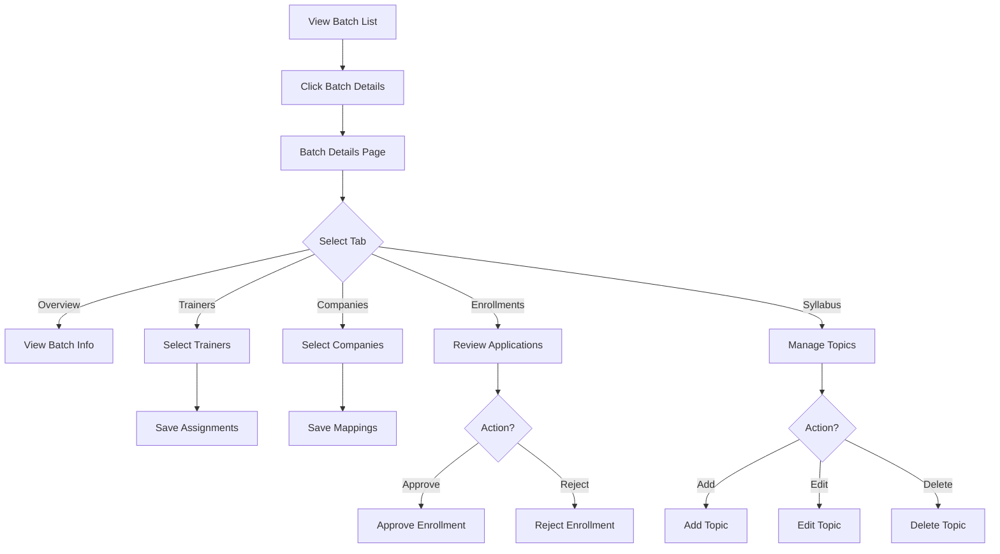
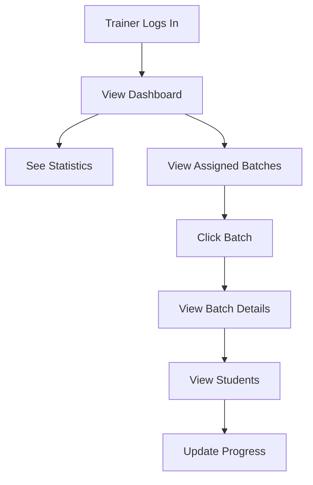
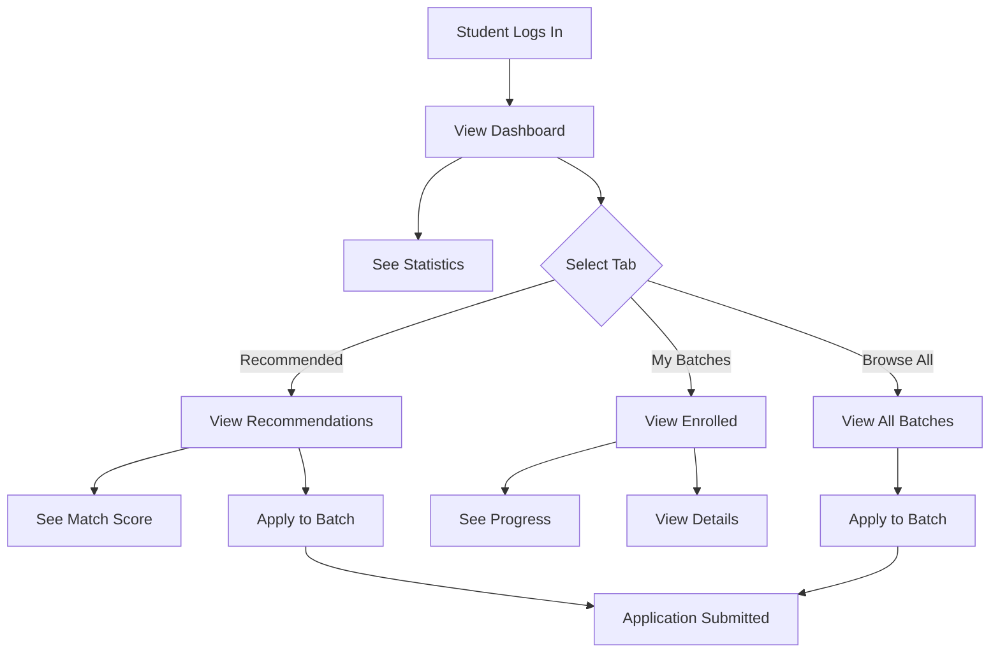

# Phase 6 & 7: Batch Details & Dashboards - Complete

This document explains the Batch Details page and Trainer/Student Dashboards we built for SkillBridge frontend.

---

## ✅ Components Created

### Phase 6: Batch Details & Advanced Management

#### 1. Batch Details API (`batch-details.ts`)

**Location:** `src/api/batch-details.ts`

**Functions:**

##### Batch Details:
- `getBatchDetails(id)` - Get comprehensive batch details with trainers, companies, syllabus

##### Trainer Assignment:
- `assignTrainersToBatch(batchId, trainerIds)` - Assign multiple trainers
- `unassignTrainerFromBatch(batchId, trainerId)` - Unassign a trainer

##### Company Mapping:
- `mapCompaniesToBatch(batchId, companyIds)` - Map multiple companies
- `unmapCompanyFromBatch(batchId, companyId)` - Unmap a company

##### Syllabus Management:
- `createSyllabus(batchId, data)` - Create syllabus for batch
- `updateSyllabus(batchId, data)` - Update syllabus
- `addSyllabusTopic(batchId, data)` - Add topic to syllabus
- `updateSyllabusTopic(batchId, topicId, data)` - Update topic
- `deleteSyllabusTopic(batchId, topicId)` - Delete topic

##### Enrollment Management:
- Re-exported from `college-admin.ts`:
  - `getBatchEnrollments(batchId)`
  - `approveEnrollment(batchId, enrollmentId)`
  - `rejectEnrollment(batchId, enrollmentId)`

**Types:**
- `BatchDetails` - Extended batch with trainers, companies, syllabus
- `Syllabus` - Syllabus with topics
- `SyllabusTopic` - Individual topic with metadata

---

#### 2. Batch Details Page (`BatchDetails.tsx`)

**Location:** `src/pages/admin/batches/BatchDetails.tsx`

**Features:**
- **Tabbed Interface** with 5 tabs:
  1. **Overview**: Basic batch information and statistics
  2. **Trainers**: Assign/unassign trainers (multi-select)
  3. **Companies**: Map/unmap companies (multi-select)
  4. **Enrollments**: Approve/reject student applications
  5. **Syllabus**: Create and manage syllabus topics

**Overview Tab:**
- Batch name, description, status
- Enrolled students count
- Start/end dates
- Status badge

**Trainers Tab:**
- Checkbox list of all trainers
- Shows trainer details (name, email, department, specialization)
- Active/inactive status indicators
- Save assignments button
- Real-time updates

**Companies Tab:**
- Checkbox list of all companies
- Shows company details (name, domain, hiring type)
- Save mappings button
- Real-time updates

**Enrollments Tab:**
- Three sections: Pending, Approved, Rejected
- Table view with student information
- Approve/Reject buttons for pending enrollments
- Status badges
- Applied date display

**Syllabus Tab:**
- Create syllabus if not exists
- Add topics with:
  - Title (required)
  - Description (optional)
  - Difficulty level (Beginner/Intermediate/Advanced)
  - Estimated hours
  - Order number
- Edit existing topics
- Delete topics with confirmation
- Topics sorted by order
- Visual topic cards with metadata

**User Experience:**
- Loading states for all operations
- Error handling with alerts
- Confirmation dialogs for destructive actions
- Real-time cache invalidation
- Form validation with Zod
- Responsive design

---

### Phase 7: Trainer & Student Dashboards

#### 3. Trainer API (`trainer.ts`)

**Location:** `src/api/trainer.ts`

**Functions:**

##### Dashboard:
- `getTrainerDashboardStats()` - Get trainer statistics

##### Batches:
- `getTrainerBatches()` - Get assigned batches
- `getBatchStudents(batchId)` - Get students in a batch

##### Progress Tracking:
- `getStudentProgress(batchId, studentId)` - Get student's topic progress
- `updateStudentProgress(batchId, studentId, data)` - Update topic status

**Types:**
- `TrainerDashboardStats` - Statistics for dashboard
- `TrainerBatch` - Batch with enrollment info
- `TrainerStudent` - Student with progress summary
- `ProgressTopic` - Topic with status and feedback
- `StudentProgress` - Complete progress for a student

---

#### 4. Trainer Dashboard (`TrainerDashboard.tsx`)

**Location:** `src/pages/trainer/dashboard/TrainerDashboard.tsx`

**Features:**
- **Statistics Cards**:
  - Assigned Batches (with active count)
  - Total Students (across all batches)
  - Pending Progress Updates

- **Assigned Batches List**:
  - Card view of all assigned batches
  - Batch name, status, description
  - Student count
  - Syllabus topic count
  - Date range
  - "View Details" button linking to batch management

- **User Experience**:
  - Loading states
  - Error handling
  - Empty state when no batches assigned
  - Clickable statistics cards
  - Responsive grid layout

---

#### 5. Student API (`student.ts`)

**Location:** `src/api/student.ts`

**Functions:**

##### Dashboard:
- `getStudentDashboardStats()` - Get student statistics

##### Batches:
- `getRecommendedBatches()` - Get AI-recommended batches
- `getAllAvailableBatches()` - Get all open batches
- `getStudentBatches()` - Get enrolled batches
- `getBatchDetails(batchId)` - Get batch details

##### Enrollment:
- `applyToBatch(batchId)` - Apply to a batch

##### Progress:
- `getMyProgress(batchId)` - Get own progress for a batch

**Types:**
- `StudentDashboardStats` - Statistics for dashboard
- `RecommendedBatch` - Batch with match score and reasons
- `StudentBatch` - Enrolled batch with progress
- `StudentProgressTopic` - Topic with status

---

#### 6. Student Dashboard (`StudentDashboard.tsx`)

**Location:** `src/pages/student/dashboard/StudentDashboard.tsx`

**Features:**
- **Statistics Cards**:
  - Enrolled Batches (with active count)
  - Completed Batches
  - Topics Completed (across all batches)

- **Tabbed Interface** with 3 tabs:

  1. **Recommended Tab**:
     - AI-recommended batches based on profile
     - Match score with star rating
     - Match reasons (why it's recommended)
     - Trainer names
     - Company count
     - Enrollment count
     - Apply button
     - View Details button

  2. **My Batches Tab**:
     - Enrolled batches list
     - Progress bars with completion percentage
     - Topics completed count
     - Trainer names
     - Company count
     - View Progress button

  3. **Browse All Tab**:
     - All available batches
     - Apply button (only for OPEN status)
     - View Details button
     - Filtered to show only enrollable batches

- **User Experience**:
  - Loading states
  - Error handling
  - Empty states with helpful messages
  - Progress visualization
  - Match score highlighting
  - Confirmation dialogs for applications
  - Real-time updates after applying

---

## 📁 File Structure

```
src/
├── api/
│   ├── batch-details.ts              # ✅ New - Batch details API
│   ├── trainer.ts                    # ✅ New - Trainer API
│   └── student.ts                    # ✅ New - Student API
├── pages/
│   ├── admin/
│   │   └── batches/
│   │       └── BatchDetails.tsx      # ✅ New
│   ├── trainer/
│   │   └── dashboard/
│   │       └── TrainerDashboard.tsx  # ✅ New
│   └── student/
│       └── dashboard/
│           └── StudentDashboard.tsx  # ✅ New
└── App.tsx                            # ✅ Updated with routes
```

---

## 🎯 Design Principles Applied

### 1. **Component Composition**
- Tabbed interfaces for complex pages
- Reusable stat cards
- Modular tab components
- Clean separation of concerns

### 2. **State Management**
- React Query for server state
- Local state for UI interactions
- Optimistic updates where appropriate
- Automatic cache invalidation

### 3. **User Experience**
- Progressive disclosure (tabs)
- Visual feedback (progress bars, badges)
- Empty states with guidance
- Loading states everywhere
- Error handling with recovery

### 4. **Data Flow**
- Clear API layer separation
- Type-safe data structures
- Proper error propagation
- Efficient cache management

### 5. **Form Handling**
- React Hook Form for complex forms
- Zod validation schemas
- Real-time validation feedback
- Inline editing capabilities

### 6. **Accessibility**
- Proper ARIA labels
- Keyboard navigation
- Screen reader support
- Focus management

---

## 🔄 User Flows

### Batch Details Management Flow



### Trainer Dashboard Flow



### Student Dashboard Flow



---

## 📝 Key Features

### Batch Details Page

1. **Multi-Tab Interface**:
   - Clean organization of complex functionality
   - Easy navigation between sections
   - Contextual actions per tab

2. **Trainer Assignment**:
   - Multi-select with checkboxes
   - Visual feedback for selected trainers
   - Batch save operation
   - Real-time updates

3. **Company Mapping**:
   - Multi-select with checkboxes
   - Company details display
   - Batch save operation
   - Real-time updates

4. **Enrollment Management**:
   - Three-state workflow (Pending/Approved/Rejected)
   - Quick approve/reject actions
   - Student information display
   - Application date tracking

5. **Syllabus Management**:
   - Create syllabus if missing
   - Add/edit/delete topics
   - Topic ordering
   - Difficulty levels
   - Estimated hours
   - Inline editing

### Trainer Dashboard

1. **Statistics Overview**:
   - Quick metrics at a glance
   - Clickable cards for navigation
   - Active vs total counts

2. **Batch List**:
   - Card-based layout
   - Status badges
   - Student counts
   - Topic counts
   - Quick navigation

### Student Dashboard

1. **Personalized Recommendations**:
   - Match score with visual indicator
   - Match reasons explanation
   - One-click application
   - Batch details preview

2. **Progress Tracking**:
   - Visual progress bars
   - Completion percentages
   - Topic counts
   - Per-batch progress

3. **Batch Discovery**:
   - Recommended batches
   - Enrolled batches
   - Browse all batches
   - Easy application process

---

## 🧪 Testing Checklist

- [x] Batch Details page loads correctly
- [x] All tabs render properly
- [x] Trainer assignment works
- [x] Company mapping works
- [x] Enrollment approval/rejection works
- [x] Syllabus creation works
- [x] Topic add/edit/delete works
- [x] Trainer Dashboard loads statistics
- [x] Trainer Dashboard shows assigned batches
- [x] Student Dashboard loads statistics
- [x] Student Dashboard shows recommendations
- [x] Student Dashboard shows enrolled batches
- [x] Student Dashboard shows available batches
- [x] Apply to batch works
- [x] Progress bars display correctly
- [x] Match scores display correctly
- [x] Loading states work
- [x] Error handling works
- [x] Empty states display correctly
- [x] All routes configured
- [x] No TypeScript errors
- [x] No linting errors

---

## 🚀 Next Steps (Future Enhancements)

1. **Trainer Batch Details Page**:
   - View batch students
   - Update student progress
   - Provide feedback

2. **Student Batch Details Page**:
   - View batch information
   - Track own progress
   - View companies
   - View trainers

3. **Progress Tracking UI**:
   - Visual progress indicators
   - Topic status management
   - Feedback display

4. **Enhancements**:
   - Bulk operations
   - Advanced filtering
   - Export functionality
   - Notifications
   - Real-time updates

---

## 📚 Key Learnings

1. **Tabbed Interfaces**: Excellent for organizing complex functionality
2. **Multi-Select Patterns**: Checkbox lists for bulk operations
3. **Progress Visualization**: Progress bars improve UX
4. **Match Scoring**: Visual indicators help users understand recommendations
5. **State Management**: React Query handles complex data dependencies well
6. **Form Validation**: Zod schemas ensure data integrity
7. **Empty States**: Helpful messages guide users
8. **Cache Invalidation**: Strategic invalidation keeps UI in sync

---

## 🎉 Phase 6 & 7 Complete!

All Batch Details and Dashboard pages are:
- ✅ Fully implemented with best practices
- ✅ Comprehensive functionality
- ✅ Excellent user experience
- ✅ Error handling
- ✅ Loading states
- ✅ Role-based access control
- ✅ Responsive design
- ✅ Accessible
- ✅ Integrated with AuthContext
- ✅ Ready for backend integration

**College Admins can now:**
- ✅ Manage batch details comprehensively
- ✅ Assign trainers to batches
- ✅ Map companies to batches
- ✅ Manage student enrollments
- ✅ Create and manage syllabus

**Trainers can now:**
- ✅ View assigned batches
- ✅ See dashboard statistics
- ✅ Navigate to batch management

**Students can now:**
- ✅ View personalized recommendations
- ✅ See enrolled batches with progress
- ✅ Browse and apply to batches
- ✅ Track learning progress

**Ready for production deployment!**

