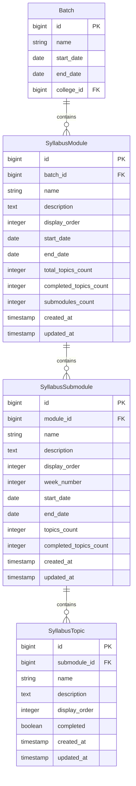

# Unified Curriculum System - Feature Documentation

## Overview

The Unified Curriculum System is a comprehensive module management feature that merges the traditional **Syllabus** and **Timeline** concepts into a single, cohesive interface. This system enables trainers to structure, schedule, and track learning content across a 3-level hierarchy: **Module → Sub-module → Topic**.

## Table of Contents

1. [Feature Architecture](#feature-architecture)
2. [Database Schema](#database-schema)
3. [API Endpoints](#api-endpoints)
4. [Frontend Components](#frontend-components)
5. [User Workflows](#user-workflows)
6. [Design Decisions](#design-decisions)

---

## Feature Architecture

### 3-Level Hierarchy

```
Batch (Full Stack Java)
├── Module 1: Java Fundamentals (Month 1)
│   ├── Sub-module 1.1: Introduction to Java (Week 1)
│   │   ├── Topic 1.1.1: History of Java
│   │   ├── Topic 1.1.2: JVM Architecture
│   │   └── Topic 1.1.3: First Java Program
│   └── Sub-module 1.2: OOP Concepts (Week 3)
│       ├── Topic 1.2.1: Classes and Objects
│       ├── Topic 1.2.2: Inheritance
│       └── Topic 1.2.3: Polymorphism
├── Module 2: Spring Framework (Month 2)
│   └── ...
└── ...
```

### Key Concepts

**Module**
- Represents a major learning unit (typically 1 month)
- Has start and end dates for scheduling
- Contains multiple sub-modules
- Tracks overall progress across all topics

**Sub-module**
- Represents a specific topic area within a module
- Can have week numbers for granular scheduling
- Has optional start and end dates
- Contains multiple topics
- Tracks completion of its topics

**Topic**
- The smallest unit of learning content
- Can be marked as completed/incomplete
- Represents a specific concept or lesson
- Contributes to sub-module and module completion percentages

---

## Database Schema

### Entity Relationship Diagram



### Table Details

#### `syllabus_modules`

Primary table for modules within a batch.

```sql
CREATE TABLE syllabus_modules (
    id BIGSERIAL PRIMARY KEY,
    batch_id BIGINT NOT NULL REFERENCES batches(id) ON DELETE CASCADE,
    name VARCHAR(255) NOT NULL,
    description TEXT,
    display_order INTEGER DEFAULT 1,
    start_date DATE,
    end_date DATE,
    total_topics_count INTEGER DEFAULT 0,
    completed_topics_count INTEGER DEFAULT 0,
    submodules_count INTEGER DEFAULT 0,
    created_at TIMESTAMP DEFAULT CURRENT_TIMESTAMP,
    updated_at TIMESTAMP DEFAULT CURRENT_TIMESTAMP
);

CREATE INDEX idx_syllabus_modules_batch ON syllabus_modules(batch_id);
CREATE INDEX idx_syllabus_modules_order ON syllabus_modules(batch_id, display_order);
```

**Key Fields:**
- `display_order`: Controls the order of modules in the UI
- `start_date` / `end_date`: Month-level scheduling
- `total_topics_count`: Cached count of all topics across all sub-modules
- `completed_topics_count`: Cached count of completed topics
- `submodules_count`: Denormalized count for quick display

#### `syllabus_submodules`

Organizes topics within a module.

```sql
CREATE TABLE syllabus_submodules (
    id BIGSERIAL PRIMARY KEY,
    module_id BIGINT NOT NULL REFERENCES syllabus_modules(id) ON DELETE CASCADE,
    name VARCHAR(255) NOT NULL,
    description TEXT,
    display_order INTEGER DEFAULT 1,
    week_number INTEGER,
    start_date DATE,
    end_date DATE,
    topics_count INTEGER DEFAULT 0,
    completed_topics_count INTEGER DEFAULT 0,
    created_at TIMESTAMP DEFAULT CURRENT_TIMESTAMP,
    updated_at TIMESTAMP DEFAULT CURRENT_TIMESTAMP
);

CREATE INDEX idx_syllabus_submodules_module ON syllabus_submodules(module_id);
CREATE INDEX idx_syllabus_submodules_order ON syllabus_submodules(module_id, display_order);
```

**Key Fields:**
- `week_number`: Optional week designation (e.g., Week 1, Week 2)
- `topics_count`: Denormalized count of topics
- `completed_topics_count`: Cached count for progress tracking

#### `syllabus_topics`

Individual learning units.

```sql
CREATE TABLE syllabus_topics (
    id BIGSERIAL PRIMARY KEY,
    submodule_id BIGINT NOT NULL REFERENCES syllabus_submodules(id) ON DELETE CASCADE,
    name VARCHAR(255) NOT NULL,
    description TEXT,
    display_order INTEGER DEFAULT 1,
    completed BOOLEAN DEFAULT FALSE,
    created_at TIMESTAMP DEFAULT CURRENT_TIMESTAMP,
    updated_at TIMESTAMP DEFAULT CURRENT_TIMESTAMP
);

CREATE INDEX idx_syllabus_topics_submodule ON syllabus_topics(submodule_id);
CREATE INDEX idx_syllabus_topics_completed ON syllabus_topics(submodule_id, completed);
```

**Key Fields:**
- `completed`: Boolean flag for completion status
- `display_order`: Controls topic ordering within sub-module

### Database Constraints

**Cascading Deletes:**
- Deleting a batch → deletes all modules
- Deleting a module → deletes all sub-modules
- Deleting a sub-module → deletes all topics

**Referential Integrity:**
- All foreign keys have `ON DELETE CASCADE` to maintain data consistency
- Indexes on foreign keys for query performance

---

## API Endpoints

### Module Endpoints

| Method | Endpoint | Description |
|--------|----------|-------------|
| GET | `/api/v1/batches/{batchId}/syllabus` | Fetch all modules for a batch |
| POST | `/api/v1/batches/{batchId}/modules` | Create a new module |
| PUT | `/api/v1/syllabus/modules/{moduleId}` | Update a module |
| DELETE | `/api/v1/syllabus/modules/{moduleId}` | Delete a module |

### Sub-module Endpoints

| Method | Endpoint | Description |
|--------|----------|-------------|
| POST | `/api/v1/syllabus/modules/{moduleId}/submodules` | Create a sub-module |
| PUT | `/api/v1/syllabus/submodules/{submoduleId}` | Update a sub-module |
| DELETE | `/api/v1/syllabus/submodules/{submoduleId}` | Delete a sub-module |

### Topic Endpoints

| Method | Endpoint | Description |
|--------|----------|-------------|
| POST | `/api/v1/syllabus/submodules/{submoduleId}/topics` | Create a topic |
| PUT | `/api/v1/syllabus/topics/{topicId}` | Update a topic |
| DELETE | `/api/v1/syllabus/topics/{topicId}` | Delete a topic |
| PUT | `/api/v1/syllabus/topics/{topicId}/toggle-completion` | Toggle topic completion |

### Request/Response Examples

**Create Module:**
```json
POST /api/v1/batches/1/modules
{
  "name": "Java Fundamentals",
  "description": "Core Java concepts",
  "displayOrder": 1,
  "startDate": "2026-02-01",
  "endDate": "2026-02-28"
}
```

**Create Sub-module:**
```json
POST /api/v1/syllabus/modules/5/submodules
{
  "name": "Introduction to Java",
  "description": "History, JVM, JDK, JRE",
  "displayOrder": 1,
  "weekNumber": 1,
  "startDate": "2026-02-01",
  "endDate": "2026-02-14"
}
```

**Toggle Topic Completion:**
```json
PUT /api/v1/syllabus/topics/23/toggle-completion
// No body required - toggles current state
```

---

## Frontend Components

### Component Hierarchy

```
SyllabusTab.tsx (Main Container)
├── Accordion (Radix UI)
│   └── ModuleAccordion.tsx (For each module)
│       ├── Accordion (Nested)
│       │   └── SubmoduleAccordion (For each sub-module)
│       │       └── TopicRow (For each topic)
│       ├── EditModuleDialog.tsx
│       └── CreateSubmoduleDialog.tsx
├── CreateModuleDialog.tsx
└── CopySyllabusDialog.tsx
```

### Key Components

#### SyllabusTab.tsx
- Main container for the curriculum view
- Fetches syllabus data using React Query
- Displays overall progress
- Renders list of modules
- Location: `src/components/batch-management/SyllabusTab.tsx`

#### ModuleAccordion.tsx
- Displays a single module with its sub-modules
- Handles expansion/collapse
- Manages Edit/Delete actions for modules
- Opens CreateSubmoduleDialog
- Location: `src/components/batch-management/ModuleAccordion.tsx`

#### CreateSubmoduleDialog.tsx
- Form for creating new sub-modules
- Fields: name, description, display order, week number, dates
- Auto-calculates next display order
- Location: `src/components/batch-management/CreateSubmoduleDialog.tsx`

#### SubmoduleAccordion (Function Component)
- Renders a single sub-module with its topics
- Shows week number and date range badges
- Displays progress (completed/total topics)
- Defined within: `ModuleAccordion.tsx`

### State Management

**React Query for Server State:**
```typescript
const { data: syllabus } = useQuery({
  queryKey: ['syllabus', batchId],
  queryFn: () => syllabusApi.fetchSyllabus(batchId),
});
```

**Local UI State:**
```typescript
const [isEditOpen, setIsEditOpen] = useState(false);
const [isCreateSubmoduleOpen, setIsCreateSubmoduleOpen] = useState(false);
```

---

## User Workflows

### Creating a Module

1. Navigate to Batch Details → Syllabus tab
2. Click "+ Add Module" button
3. Fill in module details:
   - Name (required)
   - Description (optional)
   - Display Order (auto-calculated)
   - Start Date & End Date (for scheduling)
4. Click "Create Module"
5. Module appears in the list

### Creating a Sub-module

1. Expand a module by clicking on it
2. Click "+ Add Sub-module" button
3. Fill in sub-module details:
   - Name (required)
   - Description (optional)
   - Week Number (optional)
   - Start Date & End Date (optional)
4. Click "Create Sub-module"
5. Sub-module appears nested under the module

### Managing Topics

1. Expand a module
2. Expand a sub-module
3. Click "+ Add Topic" button (future implementation)
4. Toggle topic completion with checkboxes
5. Edit/Delete topics as needed

### Progress Tracking

- **Topic level:** Checkbox shows completed state
- **Sub-module level:** "X/Y topics" badge and percentage
- **Module level:** Aggregated stats from all sub-modules
- **Batch level:** Overall progress shown at top of Syllabus tab

---

## Design Decisions

### 1. Denormalized Counts

**Decision:** Store `topics_count` and `completed_topics_count` at both sub-module and module levels.

**Rationale:**
- Avoid expensive JOIN queries for every list view
- Enable fast progress calculations
- Update counts via JPA lifecycle callbacks (`@PrePersist`, `@PreUpdate`, `@PreRemove`)

**Trade-off:** Slight complexity in maintaining count consistency, but massive performance gain.

### 2. Cascading Deletes

**Decision:** Use database-level `ON DELETE CASCADE` for all relationships.

**Rationale:**
- Ensures data integrity
- Prevents orphaned records
- Simplifies backend code (no manual cleanup needed)

### 3. Nested Accordions

**Decision:** Use Radix UI Accordion components for both modules and sub-modules.

**Rationale:**
- Accessible and keyboard-navigable
- Clean visual hierarchy
- User can expand multiple modules/sub-modules simultaneously

**Critical Requirement:** All `<AccordionItem>` components must be wrapped in an `<Accordion>` parent for React context to work properly.

### 4. Week Numbers vs Dates

**Decision:** Support both week numbers AND date ranges for sub-modules.

**Rationale:**
- Week numbers provide quick reference ("Week 3")
- Date ranges allow precise scheduling
- Trainers can use either or both

### 5. Lazy Loading Topics

**Decision:** Load topics lazily when sub-modules are accessed, not eagerly.

**Rationale:**
- Avoid Hibernate `MultipleBagFetchException`
- Reduce initial payload size
- Topics load within same transaction when sub-module is expanded

---

## Implementation Notes

### Hibernate Optimization

To fetch modules with sub-modules efficiently:

```java
@Query("SELECT DISTINCT m FROM SyllabusModule m " +
        "LEFT JOIN FETCH m.submodules " +
        "WHERE m.batch.id = :batchId " +
        "ORDER BY m.displayOrder")
List<SyllabusModule> findByBatchIdWithSubmodulesAndTopics(@Param("batchId") Long batchId);
```

**Note:** Only fetch ONE level deep (submodules). Topics are loaded lazily within the same transaction.

### Vite Proxy Configuration

Frontend requires proxy to forward API calls to backend:

```typescript
// vite.config.ts
export default defineConfig({
  server: {
    proxy: {
      '/api': {
        target: 'http://localhost:8080',
        changeOrigin: true,
      },
    },
  },
})
```

### Progress Calculation

Progress is calculated at each level:

```typescript
const completionPercentage = totalCount > 0 
  ? Math.round((completedCount / totalCount) * 100) 
  : 0;
```

Cascades up: Topic → Sub-module → Module → Batch

---

## Future Enhancements

1. **Timeline Visualization**
   - Calendar view of all modules/sub-modules
   - Gantt chart for scheduling conflicts
   - Highlight current week/module

2. **Automatic Scheduling**
   - Auto-suggest dates based on batch duration
   - Distribute modules evenly across batch timeline
   - Detect and warn about scheduling conflicts

3. **Bulk Operations**
   - Import curriculum from template
   - Copy sub-modules between modules
   - Bulk toggle topic completion

4. **Analytics**
   - Student-wise progress tracking
   - Identify lagging topics
   - Compare actual vs planned progress

5. **Notifications**
   - Remind trainers of upcoming modules
   - Alert on falling behind schedule
   - Completion milestones

---

## Related Documentation

- [Database Schema Documentation](file:///home/nanda-kishore-r/skillbridge_v2/docs/07-database-schema.md)
- [Backend Structure](file:///home/nanda-kishore-r/skillbridge_v2/docs/05-backend-structure-explained.md)
- [Frontend Setup](file:///home/nanda-kishore-r/skillbridge_v2/docs/10-frontend-setup-complete.md)
- [Flyway Migrations](file:///home/nanda-kishore-r/skillbridge_v2/docs/08-flyway-migrations-explained.md)

---

**Last Updated:** January 30, 2026  
**Version:** 1.0  
**Author:** Development Team
